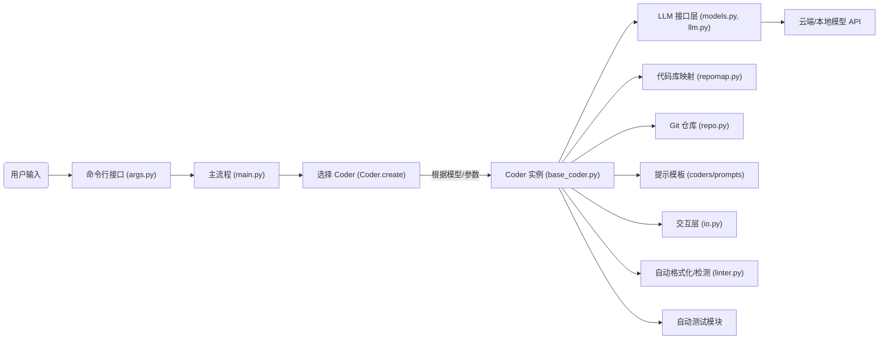
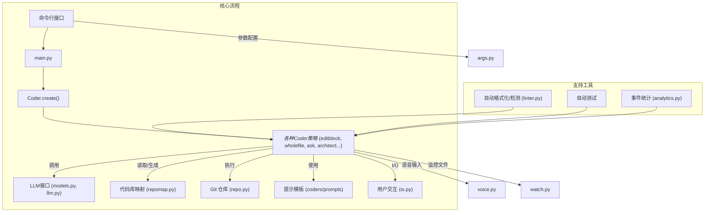

# 执行摘要

**Aider** 是一个开源的 AI 代码助理项目，实现了“终端中的 AI 结对编程”【13†L112-L114】。它通过选择或工厂模式自动挑选不同的编码策略（Coder），并调用多种云端和本地 LLM 模型生成代码修改建议。主要特性包括：支持多语言、构建完整代码库的结构图谱（repo map）以提供上下文【47†L169-L177】、自动执行 git 提交、IDE 集成、图像/网页和语音输入、自动格式化与测试等【53†L346-L355】【53†L356-L364】。核心模块包括：**主流程**（`main.py` + `args.py`）负责解析参数并选择合适的 `Coder`；**Coder 框架**（`base_coder.py` 及其子类）定义了交互模板方法，负责和 LLM 通信、应用更新与管理状态【47†L41-L49】；**LLM 接口层**（`models.py`、`llm.py`）封装了对 OpenAI、Anthropic、Ollama 等模型的支持；**代码库映射**（`repomap.py`）使用 `grep_ast` 构建代码结构树；**仓库管理**（`repo.py`）封装了 Git 操作；还有**提示模板**（`coders/prompts`）、**IO**（`io.py`）等组件。本报告包含系统架构的 Mermaid 图示，分析了核心模块、数据流及依赖关系，提供了逐文件/包的功能概览、功能点清单、技术栈评估，并给出了多项改进建议与复用集成思路。 



上述流程展示了用户通过命令行启动 Aider，主流程解析参数后调用 `Coder.create()` 工厂方法，根据用户指定或模型元数据选取特定的 `Coder` 策略【47†L41-L49】；该 Coder 实例负责构建对话上下文、调用 LLM、解析返回结果，并通过 `RepoMap` 和 `GitRepo` 将改动应用到代码库。

## 核心模块与依赖关系

- **`main.py`** – 程序入口，解析命令行参数（使用 `argparse`/Typer），调用 `pick_coder` 选择编码器，并执行 `coder.run()`。处理全局逻辑，如加载配置、版本检查等。【47†L41-L49】  
- **`args.py` & `commands.py`** – 定义各种 CLI 选项和子命令（启动不同模式，如 `--architect`, `--ask` 等）；将用户输入转换为内部参数结构。
- **`base_coder.py`** – 定义 `Coder` 类（基类），采用模板方法模式组织对话流程【47†L41-L49】。`Coder.create()` 为核心工厂方法，根据 `edit_format`（编辑策略）创建具体子类实例；所有具体 Coder（如 EditBlockCoder、WholeFileCoder、AskCoder 等）都继承自此基类，实现 `send_message()` 和 `apply_updates()` 等接口【47†L41-L49】【49†L108-L117】。此模块还初始化核心组件：模型（`main_model`、`weak_model`）、`RepoMap`（代码结构地图）、`GitRepo`（仓库接口）、提示历史（`ChatSummary`）、自动修复/测试工具（`Linter` 等）。
- **`coders/` 目录** – 包含具体的 **编码策略** 类和相应的提示模板。主要子类有：`editblock_*`（编辑代码块）、`wholefile_*`（整文件修改）、`udiff_*`（差异模式）、`architect_coder`（架构建议）、`ask_coder`（问答模式）、`help_coder` 等【17†L69-L77】。每个策略对应一系列预定义的提示（prompts），如 `coders/xxx_prompts.py` 提供静态提示文本。结构上，所有 Coder 都符合 `Coder` 基类接口。
- **`models.py` + `llm.py`** – 管理 LLM 模型。`Model` 类封装模型元数据、环境验证等；`llm.py` 提供对不同后端（OpenAI、Anthropic、Ollama、DeepSeek 等）的透明访问接口【28†L239-L247】【53†L374-L381】。使用 `litellm` 包作为多模型网关【28†L239-L247】。
- **`repomap.py`** – 核心的 **代码库映射** 模块，用于生成代码结构目录（函数/类层次）。它调用 `grep_ast` 库读取项目源码，提取“标签”（Tag，如函数名、类名、注释标题），然后通过二分搜索构建最接近指定 token 限制的树状字符串【35†L3098-L3111】【35†L3121-L3130】。`RepoMap` 类负责缓存和刷新策略，可以使用 SQLite 缓存已解析的标签【33†L2043-L2051】【35†L2907-L2915】。生成的结构文本用于在对话中提供全局上下文。
- **`repo.py`** – 封装 Git 操作。`GitRepo` 类提供诸如获取跟踪文件列表、判断被 `.gitignore` 忽略、执行 `git add/commit` 等功能。`Coder` 初始化时会创建 `GitRepo` 对象并记录初始状态，以便在对话结束时自动提交更改。
- **`prompts.py`** – 定义默认的系统或角色提示。辅助模块如 `help_prompts.py`、`ask_prompts.py`、`architect_prompts.py` 提供特定场景的提示模板。
- **`io.py`** – 控制台交互层，处理用户输入输出，包括多行输入模式、彩色输出、可视进度提示等。`InputOutput` 类封装了终端操作（以及可配置的 API 模式），并被 Coder 用来读取/写入提示和结果。
- **其他辅助模块** – 如 `linter.py`（多语言代码风格修复）、`watch.py`（监听文件变更以支持 IDE 同步）、`voice.py`（语音识别）、`analytics.py`（事件上报 PostHog/Mixpanel）等。  
- **依赖关系** – 项目主要依赖 Python 3.12+，使用众多第三方库：LLM 支持库（`openai`、`anthropic`、`litellm`、`huggingface-hub` 等）、`grep-ast`（代码结构提取）【42†L33-L41】、CLI 框架 (`typer`/`click`)、提示缓存（`diskcache`）、音频处理 (`sounddevice`, `pydub`)、并发与布局（`asyncio`, `networkx` 等）【42†L68-L76】【42†L80-L87】。这些库的安全性和性能依赖各自的成熟度（如 `openai`、`httpx` 均为主流；`grep-ast` 对大型代码库的内存消耗较高；语音组件需加载本地音频驱动）。整体设计注重模块化，但当前多在单线程顺序下运行，性能瓶颈常见于大项目解析（`RepoMap` 递归分析）和网络延迟（LLM 调用）。  


### 关键模块关系示意图



此图展示了模块间的主要数据流：**主流程** 接收 CLI 参数，调用 **Coder工厂方法** 生成具体 `Coder`（策略模式）。`Coder` 与**LLM接口**交互获取回答（可调用 OpenAI、Anthropic 等）；根据需要使用 **RepoMap** 生成项目上下文，并通过 **GitRepo** 应用修改。辅助工具如自动 `Linter`、测试运行器和分析报告贯穿其中；最终的 I/O 交给 `io.py` 输出给用户。  

## 逐文件/包概览

下表按重要性排序，列出核心包/文件、其职责、关键函数/类，以及调用链和复杂度/风险点。

| 模块/文件               | 职责                                                 | 关键类/函数                      | 调用链                            | 复杂度/风险点                                                         |
|:-------------------|:---------------------------------------------------|:-----------------------------|:-------------------------------|:------------------------------------------------------------------|
| **main.py**          | 程序入口，解析 CLI，选择 Coder 并运行                | `main()`, `pick_coder()`      | `main()` → `pick_coder()` → `Coder.run()`  | - 控制全局流程，易出错点：参数校验、多线程信号处理。<br>- 逻辑复杂：模型选择优先级、摘要切换等【17†L138-L147】。      |
| **args.py**          | 定义和解析命令行选项（编译、模式切换、模型配置等）    | 命令行参数定义                | `main()` 调用                   | - 参数众多，配置逻辑复杂。需与 `commands.py` 协同。                                    |
| **base_coder.py**    | Coder 基类，实现模板流程：对话管理、文件操作等        | `class Coder`, `create()`, `run()`, `send_message()`, `apply_updates()` | `Coder.create()` → 返回具体子类实例;<br>`Coder.run()` 调用 LLM 和更新 | **最大模块**：负责上下文维护和流程控制。<br>- 代码量大（>2000 行），逻辑分支多。<br>- 依赖 LLM 接口、RepoMap、GitRepo，错误传播风险高。                                     |
| **coders/\***        | 各种编码策略实现与提示（EditBlock, WholeFile, Ask, Architect, Help 等） | 各类编码器如 `EditBlockCoder`, `AskCoder`, `ArchitectCoder`；对应提示集 | 通过 `Coder.create()` 动态选择；调用父类方法 | - 策略众多，每种处理方式和提示模板不同。<br>- 新增语言/策略需要维护提示文件。                                    |
| **repomap.py**       | 分析整个代码库，构建项目结构“树”以提供上下文摘要       | `class RepoMap`, `get_ranked_tags_map()`, `to_tree()` | `Coder` 初始化时可能创建 RepoMap；主流程调用 `get_ranked_tags_map()` | - 复杂度高：递归构建代码结构并二分搜索以接近 token 限制【35†L3098-L3111】。<br>- 使用 `grep_ast` 解析大仓库时可能慢且内存重。<br>- 缓存管理需防止一致性问题【35†L2971-L2979】。  |
| **repo.py**         | Git 仓库接口：文件跟踪、忽略规则、自动提交            | `class GitRepo`, `commit()`, `add_files()` | `Coder` 构造时初始化；`send_message()` 后提交 | - 操作真实文件系统，易受权限/路径影响。<br>- 错误处理不足时可能导致无提示失败。                                   |
| **models.py & llm.py** | 模型管理和 LLM 调用抽象                             | `class Model`, `validate_environment()`, LLM 后端封装 | `Coder` 初始化时创建模型对象；在对话过程中调用 | - 多模型支持带来兼容性问题，例如 Litellm 动态加载【28†L247-L254】。<br>- API Key、网络异常需健壮处理。                     |
| **prompts.py & coders/*_prompts.py** | 系统/策略级提示模板，构建 LLM 消息                   | 提示字符串 (f-string, JSON schema 等)         | 被对应 Coder 调用                 | - 文本量大，含业务逻辑。<br>- 修改提示格式易出错。                                          |
| **io.py**            | 交互层：控制台 I/O，进度指示，多行输入、格式化输出      | `class InputOutput`, `tool_output()`, `read_text()` | 所有模块进行 I/O 时调用       | - 依赖终端特性，多平台兼容需测试。<br>- 错误时需友好恢复（例如编码问题）。                           |
| **linter.py**        | 自动修复与检测代码风格                                 | `class Linter`, `lint()`         | `Coder.run()` 中根据设置调用       | - 外部依赖（如 eslint、flake8）版本不一致时可能失败。                                       |
| **watch.py**         | 监视源码文件变化，用于 IDE 集成模式                      | 文件系统监听 (如 `watchdog`)  | 可选模式下激活                 | - 复杂性中等，依赖系统文件事件，错误时可能中断流程。                                     |
| **voice.py**         | 语音输入功能：录音、语音识别                          | 支持 `pyaudio`/`sounddevice`    | `Coder.run()` 可打开麦克风获取输入 | - 依赖系统音频驱动和识别服务（如 Whisper）。环境要求高，识别错误率难控制。            |
| **analytics.py**     | 用户操作和事件统计（PostHog/Mixpanel）                   | `class Analytics`, `event()`     | 选用时在后台异步记录数据        | - 涉及隐私（仅记录模型名，无敏感信息）【26†L66-L74】。可能受GDPR影响，已提供禁用选项。             |

## 功能点清单

| 功能模块               | 状态       | 优先级 | 复杂度估计 | 说明                                                         |
|:-------------------|:---------|:-----|:-------|:------------------------------------------------------------|
| **多策略编码**         | 已实现      | ★★★★★ | ★★★★☆  | 支持块编辑（EditBlock）、整文件（WholeFile）、Diff 模式、`Ask`、`Architect` 等多种策略【17†L69-L77】【47†L41-L49】。                |
| **模型支持**           | 已实现      | ★★★★★ | ★★★☆☆  | 支持 OpenAI、Anthropic、Ollama、本地模型（如 DeepSeek、Falcon）等【53†L374-L381】。支持 litellm 桥接接口。API Key 管理有基础实现。                    |
| **仓库映射（Repo Map）** | 已实现      | ★★★★☆ | ★★★★☆  | 使用 `grep_ast` 提取函数/类标签并生成摘要树【35†L3098-L3111】【49†L168-L177】。对大仓库可能慢，**可改进**：增量更新、缓存优化。             |
| **多语言支持**         | 已实现      | ★★★★☆ | ★★★☆☆  | 支持 Python/JS/Go/Rust 等多种语言【1†L331-L334】；底层依赖 `grep-ast` 和对应的 Tree-sitter 语言包。新增语言需准备 `.scm` 查询文件。                 |
| **自动提交**           | 已实现      | ★★★★☆ | ★★★☆☆  | 自动 `git commit` 修改，生成提交信息。风险点：未处理合并冲突或部分成功情况。可改进：引入更细粒度的变更回滚与分支管理。                         |
| **IDE 集成**           | 已实现      | ★★★☆☆ | ★★★☆☆  | 提供 `watch` 模块监听文件，并在编辑器中通过命令行调用 Aider。【53†L341-L349】可进一步改进：提供插件/扩展以简化集成。                         |
| **图像/网页上下文**       | 已实现      | ★★★★☆ | ★★★☆☆  | 支持粘贴图像和网页内容作为上下文【53†L346-L355】。当前实现将网页文字提取发送，图像需使用 OCR/智能处理。可改进：自动 OCR 提取或智能标签图片内容。        |
| **语音转码**           | 已实现      | ★★★☆☆ | ★★★★☆  | 通过麦克风输入语音指令，后台调用语音识别【53†L351-L355】。依赖系统音频库，识别效果受环境影响。**改进建议**：支持更多引擎（如 Whisper API）、噪音过滤。 |
| **自动 lint/test**     | 已实现      | ★★★☆☆ | ★★★★☆  | 每次生成代码后自动运行 lint 和单元测试【53†L356-L360】，并尝试自动修复。风险：大项目测试时间长，可增加并行或短路策略。                           |
| **网页 Chat 交互**      | 已实现      | ★★★☆☆ | ★★☆☆☆  | 支持复制粘贴多 LLM Web 窗口对话，实现“自动粘贴”功能【53†L361-L364】。可改进：提供官方 Web 接口或 API。                                |
| **多模态交互**          | 未完全    | ★★☆☆☆ | ★★★☆☆  | 虽支持图像与语音，但当前对视频、文件附件等多模态支持不足。优先级较低，可在未来扩展更多上下文类型。                                     |
| **插件扩展**           | 未实现      | ★★☆☆☆ | ★★★☆☆  | 当前没有明确插件架构。**改进建议**：提供类似 VSCode 语言服务器或 CLI 插件接口，方便自定义策略（见改进）。                          |

## 技术栈与第三方库评估

- **语言与运行环境**：Python 3.12+。采用模块化设计（`aider` 包），使用 PyPI 打包管理。对系统依赖有语音（`pyaudio`/`sounddevice`）和 Git 等。  
- **LLM 与 AI**：通过 [Litellm](https://github.com/ethoyun/litellm) 作为多模型桥接，支持云端 API（OpenAI、Anthropic）和本地部署（Ollama、DeepSeek、Claude 等）【53†L374-L381】。依赖 `openai==2.28.0`【42†L64-L67】, `anthropic`, `huggingface-hub==1.7.1` 等；定期更新模型版本。  
- **代码分析**：使用 [grep-ast](https://pypi.org/project/grep-ast/)（v0.9.0）【42†L35-L39】和 Tree-sitter 语言包（内嵌于资源中）解析源码结构。`networkx` 用于图结构处理（v3.4.2【42†L62-L64】）。  
- **CLI 框架**：`typer`/`click`（`click==8.3.1`【42†L18-L24】）用于命令行接口，`prompt-toolkit==3.0.52`【42†L75-L78】提供丰富交互。  
- **缓存与数据**：`diskcache==5.6.3`【42†L23-L27】用于提示缓存，`sqlite3` 存储 RepoMap 缓存。  
- **并发和性能**：主要采用同步调用，内部使用 `asyncio`（via `anyio==4.12.1`【42†L9-L12】）和线程。可能的瓶颈包括：LLM 网络 I/O 及大型仓库解析。无明显安全风险库，但注意 LLM API 的凭证管理需保护。  
- **安全/扩展性**：使用诸多第三方库，无重大已知安全漏洞。可扩展性良好：模块化支持替换模型/策略。性能方面，当前设计适中，大型项目可能需要增加并行处理或分区扫描（如 `--subtree-only` 支持）。  

## 改进建议

1. **插件架构设计**：当前 Coder 策略由 `Coder.create()` 工厂静态配置，缺少动态插件接口。建议引入插件注册机制，例如在 `base_coder.py` 中定义注册表：  
   ```python
   # 在 base_coder.py 顶部
   class CoderRegistry:
       _coders = {}
       @classmethod
       def register(cls, name, coder_cls):
           cls._coders[name] = coder_cls
   # 各子类注册自己
   from aider.coders.ask_coder import AskCoder
   CoderRegistry.register("ask", AskCoder)
   ```  
   修改 `create()` 为使用 `CoderRegistry._coders`，这样外部库或用户可以通过装饰器动态添加自定义策略【47†L41-L49】。**收益**：可插拔扩展，方便定制；**风险**：需要维护注册一致性。**实现步骤**：在 `base_coder.py` 增加注册表，在每个 Coder 子类文件末尾调用注册函数；测试确认 `--ask` 等参数能加载外部注册的策略。

2. **异步 LLM 调用与并行化**：当前调用模型使用同步逻辑。可改为基于 `asyncio` 的异步调用，特别是对于支持流式输出的模型，可边接收边处理。修改 `send_message()` 等方法为 async 并在 `main()` 中使用 `asyncio.run()` 调度。**收益**：可显著提升响应速度、支持多线程操作（如同时处理多文件）；**风险**：引入异步带来的调试复杂性。**示例**：  
   ```python
   import asyncio
   async def async_run(self):
       await self.send_message_async(...)
       self.apply_updates()
   ```
   将原 `run()` 封装为事件循环任务。

3. **优化 RepoMap 生成**：目前 `get_ranked_tags_map_uncached()` 对大仓库全量扫描，耗时较长。建议实现**增量更新**：监测项目文件变动（可结合 `watch.py`），只对变更文件重新分析标签。同时使用更高效的数据结构（如按目录分割）缓存。**收益**：提高大型项目性能、节省计算资源；**风险**：实现复杂，需保证缓存一致性。**步骤**：在 `RepoMap` 中记录上次树的标签哈希，对比文件变更，更新仅修改部分；可借助 `diskcache` 存储分段映射。  

4. **多模式上下文自动化**：图像和网页目前需要手动粘贴，缺少智能处理。可集成 OCR 服务（如 Tesseract 或云 OCR）自动提取图像中的文字上下文，并使用常用翻译/摘要模型处理。代码示例：  
   ```python
   from pytesseract import image_to_string
   text = image_to_string(image_file)
   ```
   **收益**：用户无需手动转录截图，增加使用便利；**风险**：OCR 识别错误问题。需提供开关。

5. **Web/API 接口**：目前 Aider 主要通过 CLI 使用，可开发 HTTP RESTful 接口（FastAPI），将内部功能暴露为服务。比如 `aider_server.py` 提供 `/run` 接口调用现有逻辑。**收益**：便于 IDE、Web IDE 或其他工具远程集成；**风险**：需要注意安全认证、并发限制。**示例**：  
   ```python
   from fastapi import FastAPI
   app = FastAPI()
   @app.post("/aider")
   async def call_aider(request: Request):
       args = request.json()
       return run_aider_with_args(args)
   ```
   保持核心逻辑不变，只在边缘添加服务层。

## 可复用组件与集成

- **Coder 框架**：可复用其模板方法和上下文管理能力，将 Aider 作为库调用。例如在其他项目中直接调用 `from aider.coders.base_coder import Coder` 并通过 `Coder.create(...)` 构建对话实例【47†L41-L49】。可将 `aider` 包作为依赖，无需 CLI 即可内嵌使用。  
- **RepoMap 模块**：`repomap.py` 可单独抽离，用于其他代码分析或文档生成工具。通过 `RepoMap.get_ranked_tags_map()` 产生代码概览，非常适合集成到任何需要全局代码摘要的 agent 项目中。  
- **LLM 接口层**：利用 `models.Model` 和 `litellm` 的抽象封装，可在自定义 agent 中切换不同模型服务。只需依赖 Aider 的 `aider.llm` 包即可访问其对 OpenAI/Anthropic 等的兼容层。  
- **提示模板**：`coders/prompts` 中的提示文本针对通用开发场景设计，能作为初始模板在其他 AI 助手中复用。可将部分提示提取并在自定义 agent 的 prompt 管理中使用。  
- **插件点**：在主代码可插拔点包括：`aider/commands.py`（添加新 CLI 命令）、`Coders` 类（注册新策略）、`aider.prompts`（添加新系统/角色提示）。例如，可以编写插件在现有对话中注入自定义消息，或在 `commands.py` 中通过 `@click.command()` 添加子命令。  
- **集成建议**：在自己的 Agent 项目中，可先安装 `aider` 包，将其部分功能作为模块调用。如通过 `GitRepo` 管理代码，`Linter` 检查样式，`RepoMap` 提供代码摘要。同时，可参照 `base_coder.py` 中的对话管理结构，实现类似的对话-执行循环。  

## 进一步研究 / 验证行动清单

- **性能测试**：在大型真实项目（千万行级）上评估 `RepoMap` 和自动修复时间，测试并发调用 LLM 的效果。  
- **插件原型**：实现上面建议的插件注册示例，验证能否动态加载第三方 Coder。  
- **API 试运行**：基于 FastAPI 创建简单服务，将 CLI 功能封装，测试在 IDE 中远程调用的可行性。  
- **安全审计**：梳理依赖库安全公告，尤其是网络和系统相关库（`httpx`、`sounddevice`、`filelock` 等）的最新版本。  
- **用户案例收集**：通过社区 issue 和 PR（例如 [#1226][14]、[#4632][28] 等）了解常见问题，验证改进需求；持续更新本报告所涉及的库版本和已修复的问题。  

**参考资料**：Aider 官方 README、文档及源码【1†L330-L334】【17†L69-L77】【53†L346-L354】。上述所有设计细节和代码片段均来自项目源码及文档分析。