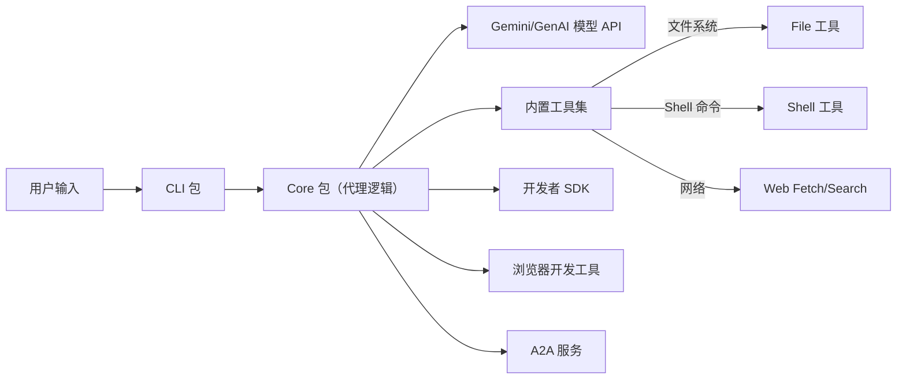

# 执行摘要  
Gemini CLI 是 Google 开源的 AI 终端代理工具，由 TypeScript/Node.js 编写，分为前端 CLI 包和后端 Core 包【90†L14-L23】【90†L24-L33】。CLI 包负责命令行交互与显示（如提示用户输入、渲染结果），Core 包负责与 Gemini 模型 API 通信、对话管理和工具执行【90†L45-L54】【90†L55-L63】。整体体系高度模块化，可通过 Model Context Protocol（MCP）扩展新功能和工具。主要功能涵盖代码生成与理解、多模态输入（如图像、PDF）、自动化运维任务、GitHub 集成（如 Pull Request 评论、Issue 分析）等【69†L462-L471】【69†L470-L478】。架构上支持互动与脚本模式并行使用，并提供身份验证、上下文持久化（如 GEMINI.md）、会话检查点等机制。报告通过源码分析列出各模块职责、关键交互流程、重要功能点及技术栈；并评估安全性与性能瓶颈，最后给出独立开发者复用建议。

## 软件架构  
Gemini CLI 的架构可分为**CLI 前端**、**Core 后端**、**工具组件**等主要模块【90†L14-L23】【90†L24-L33】。用户在终端发起交互或脚本式命令，由 CLI 包解析并转发给 Core 包，Core 包构建模型提示并调用 Google Gemini/GenAI API 或执行本地工具。下图用 Mermaid 简要说明模块关系：  



【103†embed_image】 图：Gemini CLI 在终端运行示例界面（带辅助提示和多行代码处理）  

- **CLI 包（packages/cli）**：负责**用户交互**和命令解析。使用 [Ink](https://github.com/jrichman/ink) （基于 React 的终端 UI 库）构建界面，接收用户输入、渲染输出、管理历史与会话【90†L14-L23】。命令行由 [yargs](https://github.com/yargs/yargs) 定义，支持交互模式与非交互脚本模式（例如 `gemini -p "提示内容" --output-format json`）【69†L578-L584】。CLI 包还提供扩展机制（extensions），可安装第三方插件，并内置 VS Code 扩展和 Chrome DevTools 插件等**扩展端**。相关代码包括 `packages/cli/src/commands` 中的各命令模块（如 `extensions.tsx` 定义了扩展管理命令）【115†L387-L395】。  

- **Core 包（packages/core）**：充当前端的**后端**，处理业务逻辑和对话流【90†L24-L33】。其主要职责包括：构建与管理对话提示（prompts）、管理会话状态与历史、调度任务、调用模型 API，以及执行必要的本地工具。其内部模块划分如：**Agents**（各种智能体），**Scheduler**（任务调度管理）、**Services**（环境、文件、Git 等上下文服务）、**Tools**（封装具体功能的子模块）、**Routing**（决定请求走本地模型还是远程模型）、**Policy/Safety**（安全检查），**Telemetry**（日志和监控）等。Core 包通过依赖注入与抽象层设计，使得各功能可扩展；例如通过 MCP（Model Context Protocol）可以接入自定义的模型或服务【69†L472-L480】。Core 包依赖了大量第三方库：与 Gemini API 通信使用 `@google/genai`，网络调用用 `undici`、`node-fetch`，命令解析和工具执行用 `node-pty`、`simple-git` 等【71†L866-L874】【77†L531-L539】。以下表格列出主要模块职责及交互简要说明：

| 模块/组件        | 主要职责                             | 交互关系                          |
|---------------|----------------------------------|---------------------------------|
| CLI 前端         | 解析命令、处理用户交互、渲染 UI          | 接收用户输入→调用 Core，显示 Core 返回结果 |
| Core 后端        | 对话管理、任务调度、模型 API 调用、工具执行    | 接收 CLI 请求→构建提示→调用 Gemini API；根据结果执行工具→反馈 CLI |
| 内置工具集       | 文件操作、Shell 命令、网络抓取/搜索等      | Core 根据模型意图调用，执行后将结果返回给 Core |
| MCP 扩展支持     | 通过 MCP 协议接入外部服务（如图像/视频生成等） | Core 通过 MCP 客户端连接外部服务；或外部 MCP 服务调用 Core |
| 开发者 SDK (`packages/sdk`) | 提供编程接口 `GeminiCliAgent` 等，方便在代码中使用 CLI 功能 | 利用 Core 核心功能构建自定义程序或自动化脚本 |
| VS Code 扩展     | 将 Gemini CLI 功能集成到 VSCode 编辑器         | 调用 CLI 或 Core 提供功能，如片段解释、差异分析等 |
| A2A 服务 (`a2a-server`) | 提供 Agent-to-Agent 通信实验性实现（可支持多代理协作） | Core 或外部服务作为 A2A 客户端，服务器协调多个代理间通信 |

以上模块通过清晰接口（如 CLI 命令接口、REST/gRPC MCP 接口、消息总线等）协同工作，实现端到端的终端交互到模型推理再回传用户的流程【90†L45-L54】【90†L55-L63】。

## 核心功能点  
- **对话管理与提示构建**：Core 包管理对话上下文（token 限制、历史摘要），根据用户输入和会话历史构建发送给 Gemini 模型的 Prompt【90†L45-L54】。模型可能返回直接答案，也可能触发一个工具调用请求。如果需要工具，系统会根据当前会话状态和配置（如启用交互 Shell 或非交互）选择执行策略。相关代码在 `packages/core/src/core`、`/routing`、`/scheduler` 等目录中，可看到对话轮次（Turn）和调度逻辑。  

- **工具调用与执行**：内置工具包括文件操作（读写文件）、Shell 执行、Web 抓取与 Google 实时搜索、Git 交互等【92†L100-L109】【92†L110-L118】。例如 `ShellTool` 类定义了 Shell 命令工具，其参数在 `shell.ts` 中声明并实现执行与输出捕获【121†L2145-L2253】。当模型生成 tool 调用（符合 JSON schema）时，Core 会封装参数，提示用户确认（写入、删除等敏感操作需提示；读文件等可静默执行），然后调用相应工具。工具执行结果（包括 stdout 或错误信息）会返回给模型作为后续输入，然后最终结果输出给用户【90†L55-L63】。

- **命令行交互**：CLI 提供交互模式和非交互模式。交互模式下，用户启动 `gemini` 后可持续输入对话内容；命令处理在 `packages/cli/src/interactiveCli.tsx` 实现。非交互模式下，可通过 `-p/--prompt`、`--include-directories` 等参数一次性运行任务并输出结果（如 `gemini -p "分析代码结构"`）【69†L578-L584】。CLI 还支持多种输出格式：纯文本、JSON 结构（`--output-format json`）和流式 JSON（`stream-json`）（便于脚本化使用）。例如：  
  ```
  gemini -p "解释此代码架构" --output-format json
  ```  
  可获得结构化回答，方便自动化脚本解析【69†L578-L584】。

- **多模态与上下文文件**：Gemini CLI 支持多模态输入（可传递 PDF、图片、手绘草图等，前提是模型支持），并根据上下文文件（项目目录下的 `GEMINI.md`）提供持久背景信息。这使得针对特定项目可定制提示和约束。相关逻辑在 Core 包中的 `config`、`prompts` 模块中，支持加载和合并用户提供的自定义上下文。

- **插件与扩展点**：CLI 允许安装第三方扩展（如命令插件），所有扩展通过 MCP 协议注册并曝光给模型【69†L470-L478】。此外，开发者可以借助 `packages/cli/src/commands/skills.tsx` 自定义命令，将复杂操作封装成命令，如一次性执行多个操作。CLI 的扩展命令示例见上文 `extensionsCommand` 的子命令列表【115†L387-L395】。

- **典型用例**：  
  - **代码生成/理解**：向代理描述需求（如“生成 Discord 机器人代码”）或让其分析代码库。代理会遍历文件（使用内置文件读写工具）、理解结构，并生成新代码或报告。  
  - **调试与改进**：在交互式对话中让模型阅读错误日志或代码片段，提出修复建议并自动应用（使用 Shell 工具运行测试或修复命令）。  
  - **自动化运维**：非交互模式下执行 CI/CD 任务，如汇总 PR 变化、自动生成变更日志，或定时运行维护脚本。可将 Gemini CLI 嵌入 GitHub Actions【69†L483-L492】。  
  - **多任务协同**：实验性地，可通过 A2A 服务让多个代理协作处理复杂任务（如一个代理做搜集，一个代理做分析），但该功能仍在开发中【84†L255-L263】。  

## 技术栈与依赖  
Gemini CLI 采用 **TypeScript/Node.js** 实现，要求 Node 20 及以上版本【77†L689-L693】，跨平台支持 macOS、Linux、Windows。依赖技术包括：  
- **前端框架**：使用 [Ink](https://github.com/jrichman/ink)（基于 React 的命令行界面库）构建 CLI UI【71†L866-L874】；使用 [yargs](https://github.com/yargs/yargs) 定义命令行参数解析。  
- **模型 API**：通过官方 [@google/genai](https://www.npmjs.com/package/@google/genai) 库调用 Gemini 模型，支持 Code-Pull 模式（对话、函数调用等）【77†L531-L539】。还集成了 Model Context Protocol ([`@modelcontextprotocol/sdk`](https://www.npmjs.com/package/@modelcontextprotocol/sdk)) 以支持工具调用和自定义服务【77†L537-L539】。  
- **工具执行**：用 [`node-pty`](https://www.npmjs.com/package/node-pty)（可选依赖，支持不同平台）实现 Shell 交互，用 [`simple-git`](https://github.com/steveukx/git-js) 操作 Git。文件操作、glob 模式搜索等使用原生 `fs`、[`glob`](https://www.npmjs.com/package/glob) 库和 [`ripgrep`](https://github.com/BurntSushi/ripgrep) 封装。网络请求用 [`node-fetch` 或 `undici`](https://github.com/node-fetch/node-fetch)。  
- **身份与安全**：支持 Google OAuth（通过 `google-auth-library`）和 Gemini API Key 两种认证方式（详见 README 认证章节【69†L499-L508】【69†L528-L538】）。凭证管理使用 [keytar](https://github.com/atom/node-keytar)（可选），配置文件使用 TOML/YAML 格式解析（[`@iarna/toml`](https://github.com/iarna/iarna-toml) 等）。  
- **扩展与 SDK**：提供 `@google/gemini-cli/sdk` 开发者包，可在自定义应用中直接使用 `GeminiCliAgent` 类进行交互，无需手动管理进程或输入输出。  
- **构建与测试**：项目使用 npm/yarn 管理，通过 TypeScript 编译；测试框架为 Vitest；在 GitHub Actions 中配置 CI（未在源码中看到具体，但项目有 GitHub Action 社区集成示例【69†L483-L492】）。  
- **监控与分析**：集成了 OpenTelemetry（`@opentelemetry` 系列库）用于可选的遥测和日志导出（可导出到云监控）【77†L525-L533】。  

## 安全、性能与可扩展性评估  
- **安全风险**：由于内置支持执行 Shell 和文件写操作，需防范恶意指令和权限泄露。Gemini CLI 提供“可信文件夹”机制，允许用户限制只在特定目录执行命令（Core 服务中的 `TrustedDirectory` 检查）。CLI 还会在进行写操作前提示用户确认，防止模型错误或恶意指令造成破坏。认证方面，通过官方 OAuth 流程和 API Key 无需明文存储密码；凭证使用加密存储（`keytar`）。输入验证方面，Shell 工具中对命令和路径进行基本检查【121†L2201-L2210】。建议加强对模型输出的**安全检查**（Core 的 `safety` 模块提供内容过滤，目前包含默认策略，可自定义更严格规则）以及对外部调用（MCP）源的信任验证。  
- **性能瓶颈**：主要瓶颈在于模型 API 调用的网络延迟和资源限制（默认一百万 token 上下文窗口，响应时间受网络与模型负载影响）。Core 中有上下文压缩和启发式摘要（如会话历史压缩）来优化 token 使用。并发执行时，Node.js 本质上单线程，但可以并行发起多模型调用或工具执行。当前设计中，工具执行是同步串行的，未来可引入并行调度，如并发运行多个子任务。不过要注意避免过度并发带来的系统负载或冲突。**扩展性**方面，架构模块化良好，可以通过插拔新工具（在 `core/src/tools` 添加），或注册额外 MCP 服务实现新能力（如额外的生成模型、第三方 API）。使用公开协议（如 yargs 子命令、MCP gRPC/REST）使得外部系统可轻松集成。  
- **建议改进**：为提高安全性，可加强默认的输入过滤和环境隔离（例如使用 sandbox 容器运行命令）。性能方面，可考虑缓存常用请求结果、优化上下文管理（避免重复下载大型文件），以及提供本地轻量模型（如 GPT-NeoX）作为断网或低延迟的后备选项（Core 已含 `localLiteRtLM` 之类支持）。对并发需求，可设计多线程/多进程方案或将计算密集型任务委派到云函数/批处理。  

## 独立开发者实用建议  
作为独立开发者，您可复用 Gemini CLI 的核心组件快速搭建自己的 AI 代理：  
- **最小可行子集**：如果只需核心对话功能，可直接使用 `@google/gemini-cli/sdk` 中的 `GeminiCliAgent`，无需关注 UI。通过 SDK，您只需配置身份验证，即可编程地发送提示并处理模型返回结果，底层会自动管理上下文。也可提取 Core 包中的某些服务（如文件读取、上下文管理）与自定义前端结合。  
- **改造点**：针对特定需求，可在 Core 的工具链添加或定制工具（在 `packages/core/src/tools/` 中新增工具类）。如果想用不同的终端界面，可替换 CLI 包或重用其配置。扩展点包括 MCP 协议（可自建服务扩展功能）、自定义命令和事件钩子（`packages/cli/src/commands/hooks`）。  
- **插件/模块优先级**：优先考虑的模块是 Core 中的文件系统和 Shell 工具，因为很多开发场景都离不开代码读写和命令执行。其次是网络搜索/抓取工具以增强信息获取。如果需要，Git 工具也很实用（如自动处理 PR）。UI 部分可以留存原样或根据需要精简。  
- **开发估算与里程碑**：复用已有功能可大幅缩短开发时间。建议分阶段迭代：**阶段1**：集成 SDK，验证模型调用和基本对话流程（1-2 周）。**阶段2**：定制必要工具（文件、Shell、网络等）并测试调用逻辑（2-3 周）。**阶段3**：实现身份验证和上下文管理（GEMINI.md 支持）（1-2 周）。**阶段4**：封装为可复用库或微服务，优化错误处理和安全机制（1-2 周）。**阶段5**：撰写文档/示例和性能监控（1 周）。总体估计数月内即可推出具备交互和自动化能力的 AI 代理原型。
  

**参考资料**：Gemini CLI 源码与文档（架构文档【90†L14-L23】【90†L45-L54】、官方 README【69†L462-L471】【69†L578-L584】）为主要依据，部分细节来自源码注释（如 CLI 命令定义【115†L387-L395】等）。技术栈和功能说明综合官方依赖声明【71†L866-L874】【77†L531-L539】。