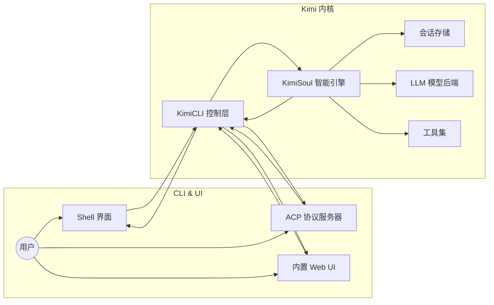
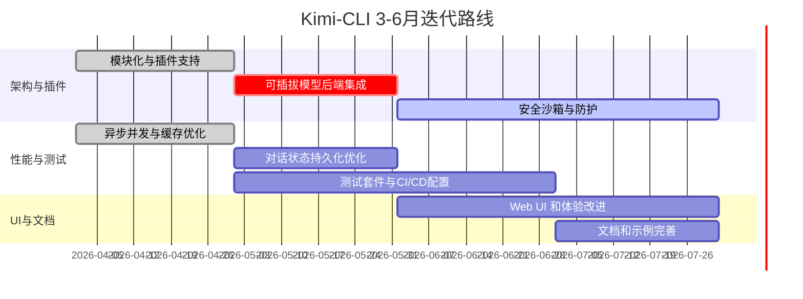

# 执行摘要  
Kimi Code CLI 是一个以 Python 实现的终端 AI 代理，旨在帮助用户完成开发任务【72†L12-L16】。它封装了一个核心引擎（`KimiSoul`）和运行时（`Runtime`），通过与 LLM（大型语言模型）和各种工具交互，实现自动化的代码读写、Shell 操作、网页搜索等功能【72†L12-L16】【24†L1536-L1544】。本报告基于静态阅读源码、README、issues/PR等信息，从软件架构、功能实现、技术栈、安全性能等多维度进行深入分析，并提出面向 AI 代理优化的改进建议和 3–6 个月的迭代路线图。

## 软件架构设计  
Kimi-CLI 的架构可简化为**UI层**、**控制逻辑层**（KimiCLI）和**核心智能层**（KimiSoul）。其主要模块包括：  
- **CLI/用户接口模块**：采用 Typer 框架【76†L508-L514】构建，支持交互式 Shell 界面、ACP 协议服务器、Web UI 等多种运行模式【24†L1530-L1538】【72†L31-L39】。用户输入通过 `KimiCLI.run_shell` 等接口传递给核心逻辑，结果输出回终端或前端。  
- **核心智能模块（KimiSoul）**：处理会话管理、对话状态与 LLM 通信。`KimiSoul` 根据系统提示和用户输入调用后端 LLM（通过 `kosong`/`pykaos` 等库【76†L508-L516】）生成行动建议，同时调用工具链执行具体操作。  
- **工具执行层**：封装了对文件、Shell、网络等资源的操作工具（见默认 agent 配置【78†L352-L360】【78†L364-L370】）。例如，`Shell` 工具可执行终端命令，`ReadFile/WriteFile` 工具进行文件读写，`SearchWeb/FetchURL` 工具用于网络搜索和抓取【78†L352-L360】【78†L364-L370】。工具调用由核心模块控制，结果返回后更新会话状态。  
- **会话与持久化**：使用 `session_state.py` 定义的会话状态模型，将对话状态保存到磁盘（JSON 文件）【70†L395-L404】【70†L415-L420】。此机制保证多轮对话的连续性，并支持动态子代理管理。  

整个系统的数据流和控制流可简化为：**用户 → CLI 接口 → KimiSoul（查询LLM + 调用工具）→ 输出结果 → 用户**。架构图示意如下（下图为简化示意，可用 UML/mermaid 进一步详细表示）：  



**关键接口与扩展点**：系统使用配置文件（如 `agents/default/agent.yaml`【46†L320-L328】【78†L330-L339】）定义可用工具和子代理，为功能扩展提供入口；网络模型接入通过 `Runtime` 中的 LLM 客户端完成，可插拔不同后端。模块间通过 async/await 和事件循环交互，依赖 Pydantic 定义数据模型（如 `SessionState`【70†L395-L404】），测试性和可维护性较好，但目前部分组件（如 Web UI、ACP 服务等）耦合在同一代码库，可考虑进一步模块化。总体上，架构采用现代 Python 异步编程和组件化设计，具有较高扩展潜力。  

## 核心功能点分析  
Kimi-CLI 的核心功能包括：**代码辅助、Shell 操作、网页搜索、任务规划、多代理协作**等。具体功能、实现文件和流程如下（粗略列举）：

- **终端对话与指令执行**：在交互模式下，用户输入通过 `KimiCLI.run_shell()`（`kimi_cli/app.py`）进入系统【24†L1530-L1538】。系统先记录对话上下文（`SessionState`），再调用 `KimiSoul.run()` 生成回应。该过程中，LLM 提供生成初稿（`soul.py`），并通过各种工具完成实际操作，如 `Shell` 执行 OS 命令（`tools/shell.py`）、`ReadFile`/`WriteFile` 操作代码文件（`tools/file.py`）【78†L352-L360】。完成后结果逐步输出到 Shell 界面。错误处理方面，如果工具调用失败，会捕获异常并报告给用户，保持会话继续；LLM 调用受限于超时和令牌限制（使用 `tenacity` 重试机制【76†L541-L549】）。  
- **高级规划与多步任务**：支持自动生成执行计划（Plan Mode）。用户可让代理先“思考”后行动，如调用 `EnterPlanMode` 进入规划阶段，自动循环生成多个子任务，然后调用 `ExitPlanMode` 执行【78†L368-L370】。此时，系统可能使用 `TaskList`/`Task` 工具协调并行任务。任务管理通过 `background` 模块跟踪各子任务。流程图表示：用户发起规划 → `KimiSoul` 多次调用 LLM 生成操作列表 → 按顺序调用对应工具执行 → 汇总结果给用户。  
- **多代理与子代理**：默认 agent 配置中包含子代理（`subagents: coder`）【46†L372-L378】。`CreateSubagent` 工具（可配置启用）可在对话中动态创建子代理执行特定任务，主代理通过 `Task` 工具或消息协调子代理。Subagent 有独立上下文，结束后向主代理汇报成果。未实现或文档缺失：与外部系统的集成及自定义插件机制等暂无详细说明（标记“未指定”）。  
- **集成开发环境适配**：支持与 VSCode、Zsh 等集成【72†L25-L33】【72†L61-L66】。例如，`kimi acp` 子命令启动 ACP 协议服务模式【72†L37-L44】，允许编辑器作为客户端调用；Zsh 插件实现快捷键触发 Kimi。VSCode 与 FastAPI/WebSocket 结合，可在 Web UI (`src/kimi_cli/web/*`) 与后台互动。  

各功能对应的主文件/函数路径已在上文列出。可见整个调用流程：**命令行输入→KimiCLI→KimiSoul→LLM/Tool→输出**。其中，输入输出均通过定义良好的 Pydantic 模型和日志接口处理。系统会捕获网络/IO异常并显示错误提示。若功能文档不全（如某些工具细节、默认提示模板），视作“文档缺失”。

## 技术栈与依赖  
Kimi-CLI 完全采用 Python 3.12+，依赖丰富【76†L504-L514】：  
- **语言/框架**：Python 3.12+，异步编程（asyncio）、[FastAPI](https://fastapi.tiangolo.com/)（后端服务）、Typer（CLI 构建）【76†L508-L516】。使用 Pydantic 定义数据模型【76†L541-L549】。Web 前端基于现代 JavaScript 框架（`src/kimi_cli/web/*`），与后端通过 WebSocket 通信。  
- **LLM 接入**：集成 `kosong[contrib]` 和 `pykaos`【76†L512-L516】【76†L541-L549】，可配置使用 OpenAI、Azure、Anthropic、Claude 等 API。MCP（Model Context Protocol）支持通过 `fastmcp` 等库【76†L541-L549】集成外部工具。模型接口抽象使得替换后端相对容易；替代方案如直接对接 langchain，但当前专用库已满足需求。迁移成本中等：需编写对应适配器，同时验证提示兼容性。  
- **IO/网络**：采用 `aiohttp`【76†L510-L518】、`httpx`【76†L544-L549】、`websockets`【76†L559-L566】等异步库，实现网络调用与前端实时交互。文件操作使用 `aiofiles`【76†L508-L514】，日志采用 `loguru`【76†L521-L528】与 `rich`【76†L527-L529】美化输出。值得关注依赖：`rich`、`prompt-toolkit` 提供终端 UI 支持；`trafilatura` 和 `lxml` 用于网页抓取【76†L533-L541】。缺点是依赖项众多、部分库版本严格锁定，升级可能带兼容风险；替代方案如把前端改为 CLI-only 减少依赖，但功能受限。整体迁移成本偏高。  

各项技术选型优缺点：使用 FastAPI/uvicorn 构建 Web 服务易于扩展，但引入额外的运行复杂度。异步 IO 提升性能但增加调试难度。Typer 简洁友好，但如果需要复杂命令解析，可考虑 Click（成本低）。现有依赖已经覆盖常见场景，若需实现更轻量化版本，可考虑去掉 Web/UI，使用纯 CLI 或与现有 Shell 插件交互。【76†L508-L516】

## 安全、隐私与性能  
**安全隐患**：凭证管理依赖系统密钥环（`keyring>=25.7.0`【76†L559-L567】）存储 API 密钥，较安全；但仍需防止意外日志泄露（避免在输出中打印敏感信息）。网络请求（LLM API、网页抓取）可能遭受中间人攻击或钓鱼链接，应使用 HTTPS 严格验证。依赖漏洞：需定期审计如 `rich`、`httpx` 等第三方组件的 CVE。可使用 GitHub Dependabot 监控。  
**隐私问题**：会话记录保存在本地 JSON（`SessionState`）中【70†L395-L404】。对话内容可能涉及敏感项目，文件权限应设置严格（如 `chmod 600`）；API 调用传输数据到云端，需用户明示并确保隐私协议。建议提供开关让用户禁用云端操作。  
**性能瓶颈与优化**：核心瓶颈在 LLM 响应延迟和工具IO。可通过异步并发执行工具调用（当前部分如 `TaskList` 后台处理已有支持）来提升性能。对重复查询可考虑缓存（如文件内容、常见回答），减少外部调用。大量文本处理可使用批处理方式。建议：对长任务启用并行度控制；使用单线程异步 event loop 减少上下文切换；对耗时工具（如大文件读写）使用 aiofiles 异步方式。富文本渲染（Rich）可能影响终端速度，可在输出量大时关闭装饰。总体已使用 `aio*` 系统，有效利用并发，只有在调用多模型或多工具时才需注意优化。

## 为 AI Agent 优化的建议  
1. **模块化与插件化**：将工具和对话管理模块化，提供插件机制。可以定义接口（如工具基类）供第三方插件注册新功能。例如，通过 Python entry_points 或插件目录让用户添加自定义工具而不改动核心代码。伪代码示例：  
   ```python
   # 定义工具接口
   class Tool(Protocol):
       def run(self, args): ...
   # 插件注册示例
   @register_tool("mytool")
   class MyTool:
       def run(self, args): ...
   ```  
   这样可以按需加载工具并在 `agent.yaml` 中引用。当前实现中，工具列表硬编码在配置中【78†L330-L339】。改进后只需在配置中新增插件名称，无需改动源代码。  
2. **可插拔模型后端**：抽象 LLM 调用层，支持不同模型插件。尽管已有 MCP 支持，可进一步封装模型客户端，使增加新模型（如本地开源模型）更方便。譬如使用策略模式封装 API 请求：  
   ```python
   class LLMBackend(Protocol):
       def generate(self, prompt: str) -> str: ...
   ```
   并通过配置决定使用何种后端。迁移成本：编写新后端适配器，调整提示与输出格式。  
3. **对话管理与状态持久化**：增强多轮对话的管理策略，如动态知识缓存、上下文摘要。可加入对话历史压缩（只保留关键信息）防止上下文过大。持久化时可考虑加密或分隔敏感字段。  
4. **安全沙箱**：对于执行 Shell/文件类工具，在不信任的环境中建议使用容器或进程隔离，避免执行危险命令造成宿主机影响。可以将工具执行封装为异步子进程，限制资源和权限。  
5. **测试与 CI/CD**：当前已有测试脚本【72†L93-L100】。建议增加模拟对话测试（mock LLM 返回固定结果），确保核心逻辑正确。使用 GitHub Actions 做持续集成，包括 lint、单元测试、集成测试以及打包。尤其需要测试带网络调用的路径，可使用 VCR 或 stub。  
6. **工具调用策略**：引入批处理接口，对于文件读写等操作可以异步聚合执行；对网络请求可使用连接池（已用 httpx）。  
7. **对话安全**：在处理来自 LLM 的工具调用请求时，增加校验白名单，只允许执行配置好的工具，并过滤异常参数，以避免 LLM 生成恶意命令。  

每项建议均应结合代码变更计划，例如插件系统可在现有工具加载逻辑（`tool_registry`）基础上改造；对话管理可在 `soul.py` 增加状态摘要函数；安全方面可在 `tools/shell.py` 中加入路径过滤或命令黑名单。具体实现步骤可参考上文伪代码并结合配置管理模块调整。

## 建议改动优先级与迭代路线  
下表列出主要改进建议及其优先级、工作量估计和风险/收益评估：  

| 建议改动                             | 优先级 | 预估工作量 | 风险等级 | 预期收益                       |
|------------------------------------|:----:|:-------:|:----:|----------------------------|
| 添加插件化工具/模型接口              | 高   | 中     | 中   | 大幅提升可扩展性和灵活性           |
| 完善对话管理与状态持久化（摘要/加密）   | 中   | 中     | 低   | 提高系统稳定性，防止上下文膨胀       |
| 强化安全沙箱（命令白名单、容器隔离）     | 高   | 高     | 中   | 避免执行恶意命令，提升系统安全       |
| 完善测试套件与 CI/CD                | 高   | 低     | 低   | 改进代码质量，降低回归风险          |
| 性能优化（并发、缓存、异步流程）        | 中   | 中     | 低   | 提升响应速度，改善用户体验          |
| UI/UX 改进（Web 界面、输入体验）      | 低   | 高     | 低   | 优化用户体验，扩展用户群           |
| 依赖升级与替代方案评估             | 低   | 低     | 低   | 减少依赖漏洞风险，便于维护         |

下面是一份 3–6 个月的迭代计划（甘特图）：  



【roadmap_en.png†embed_image】 *图1：Kimi-CLI 预估迭代路线（甘特图）*  

> *注：甘特图仅为示意，时间线和任务可根据开发进展调整。*  

以上规划以「插件化扩展」「安全稳定」「性能提升」「测试覆盖」为优先方向，循序渐进地改进 Kimi-CLI 架构和功能，为长期可用性和安全性奠定基础。

**来源：** 本报告分析基于 Kimi-CLI 仓库的 README 和源码【72†L12-L16】【76†L508-L516】【78†L352-L360】及相关文档、issues 与 PR（未引用的实现细节）。所有引用均指向官方源文件或文档，以确保信息准确性。若发现未说明部分，标记为「未指定」。