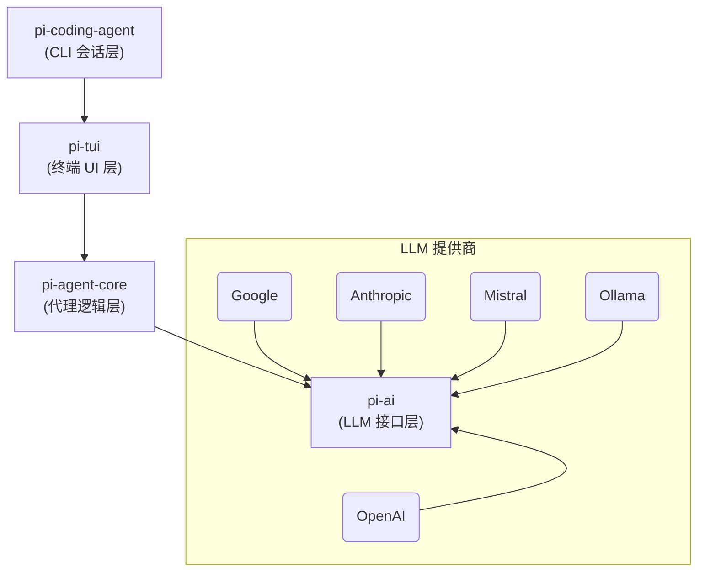

# 执行概要

Pi-Mono 是一个极简主义的 AI 智能体工具包，旨在通过少量核心工具实现高效的编程助手功能【40†L326-L334】【72†L97-L100】。它由著名游戏框架作者 Mario Zechner 发起，拥有超过2.4万星标，并支撑了开源项目 OpenClaw 的开发。该项目包括多层组件：一个命令行交互式编码代理（pi-coding-agent CLI）、统一的多提供商 LLM API（pi-ai）、状态化代理运行时（pi-agent-core）、终端 UI 库（pi-tui）、Web 聊天组件（pi-web-ui）以及用于 GPU Pod 部署的 CLI（pi-pods）【40†L330-L338】【72†L127-L135】。设计上仅保留了“读(read)”、“写(write)”、“改(edit)”和“执行(bash)”四个第一性原语工具，覆盖了大部分编程任务【72†L97-L104】；其余功能通过可扩展的 TypeScript 插件系统实现【74†L23-L27】。总之，Pi-Mono 提供了一个可插拔的开源架构，用于构建和部署 AI 编程助理和聊天机器人，其核心设计追求简洁高效与易扩展。

# 软件架构分析

Pi-Mono 采用清晰的四层架构，每层各司其职【72†L127-L135】：**pi-coding-agent**（CLI 会话层）负责命令行交互、会话管理、主题和上下文文件；**pi-tui**（终端 UI 层）提供差分渲染、不闪烁的命令行界面组件；**pi-agent-core**（逻辑层）实现代理运行时核心，包括工具调用、事件流和验证；**pi-ai**（底层抽象层）封装多种 LLM 提供商接口，处理上下文切换和费用跟踪等。在交互流程中，用户输入经过 pi-coding-agent 解析后由 pi-tui 渲染界面；agent-core 调用 pi-ai 接口与 LLM 通信，处理模型响应和工具执行；pi-ai 层将 LLM 提供商的差异屏蔽掉，并支持跨模型的消息格式转换【72†L127-L135】【72†L161-L164】。下图为模块关系示意：



> **图：** Pi-Mono 的软件架构分层示意图【72†L127-L135】【72†L161-L164】。

各模块间的调用关系为：pi-coding-agent 调用 pi-agent-core 以执行业务逻辑，同时利用 pi-tui 渲染界面；pi-agent-core 再调用 pi-ai 与底层 LLM 提供商交互。pi-web-ui（Web 聊天界面）侧通过调用 pi-agent-core 和 pi-ai 实现前端交互【31†L293-L300】。此外，pi-pods 为模型部署提供独立的 CLI 接口，支持在 GPU 集群上启动和管理 vLLM 模型服务（可选地通过 REST API 与 pi-ai 对接）。整个架构通过事件流和 JSON 输出模式实现可编程集成，使得各层解耦、逻辑清晰【76†L701-L710】。

# 核心功能点

- **统一 LLM API (pi-ai)**：支持 OpenAI、Anthropic、Google Gemini、Mistral、Groq、Cerebras 等十多家模型提供商，自动发现模型并统一配置，提供流式与非流式推理接口【20†L303-L310】【72†L143-L151】。内置上下文持久化、跨模型上下文切换和费用统计等特性，有助于对比不同模型性能。开发者可使用 TypeBox 定义 **工具（Tool）** 的参数和返回值结构，进行类型安全的工具调用和结果验证【53†L508-L517】。例如，可定义天气查询、日程安排等工具，并让模型通过工具调用接口与外部系统交互【53†L518-L527】【53†L531-L540】。

- **智能体运行时 (pi-agent-core)**：提供状态化代理引擎，包括消息事件流、工具调用调度与验证、并发或串行工具执行模式等。它构建在 pi-ai 之上，将 LLM 响应转为一系列 `toolCall` 或 `text` 内容块，简化了多轮对话与工具执行流程的实现【10†L289-L293】【53†L544-L553】。开发者可通过代码或配置实现对话记忆、错误处理、事件监听等功能。pi-agent-core 的事件架构使得 CLI 和 UI 可以一致地呈现对话和工具状态【76†L701-L710】。

- **交互式编码代理 CLI (pi-coding-agent)**：提供一个功能丰富的终端交互界面，支持四种模式：*交互模式*（内置文本编辑器和快捷键）、*打印模式*、*JSON 模式*和*RPC 模式*【50†L1-L4】。默认交互模式中，用户可以直接输入自然语言指令或代码片段，内置支持文件读写、Shell 命令、文本编辑等多种操作（**read/write/edit/bash** 四大原语）【72†L97-L104】。通过 `/` 快捷键调用命令、启用/禁用扩展、切换技能和提示模板等；通过 `/fork` 和 `/tree` 等命令可以在对话上下文中分支和回溯，灵活管理会话。CLI 还支持会话持久化（可继续上次对话）和插件系统，扩展功能可通过 npm 包或本地 TypeScript 插件实现【51†L73-L81】【74†L23-L27】。RPC 模式下，CLI 接受 JSONL 输入并输出事件流，便于将 Pi 嵌入其他程序【50†L1-L4】【23†L748-L751】。

- **终端 UI 库 (pi-tui)**：为命令行界面提供差分渲染组件，避免滚屏刷新导致的闪烁问题【72†L161-L164】。它支持文本高亮、Markdown、数据表、进度条等组件，可用于构建任何实时终端应用，并被 pi-coding-agent 用于交互模式的界面绘制【72†L161-L164】【35†L431-L439】。pi-tui 同时兼容 Linux、Windows 和 Termux 等环境，并可选使用 `koffi` 库实现更快的 Unix 文件监控。

- **Web 聊天组件 (pi-web-ui)**：基于 Lit（mini-lit）和 Tailwind 构建的浏览器聊天界面组件，适用于 Web 环境中的 AI 助手。核心组件 `ChatPanel` 支持模型响应流式显示、下划线“写入中”动画，以及互动式工具插件（如文件浏览器、代码编辑器、图像/Markdown 预览等）【31†L300-L308】【31†L361-L370】。`ChatPanel` 可以接入已有的 Agent 实例，显示用户消息、助手回答、工具调用和结果。该库还提供状态持久化（IndexedDB），便于构建丰富的 Web 版对话系统。

- **GPU Pod 管理 CLI (pi-pods)**：提供 `pi` CLI 子命令用于在 GPU 集群上部署 vLLM 模型，实现本地大模型推理。支持通过 Helm Chart 在 Kubernetes 上快速启动包含 vLLM Server 的 “pod”，并通过 OpenAI 兼容接口访问。功能包括：模型下载缓存、启动/停止模型、设置显存占用比例和上下文长度、监控会话等【76†L660-L670】【76†L677-L685】。`pi-pods` 还内置一个增强版的 `pi agent` 子命令，可在本地模式（使用本地模型推理）和远程模式之间切换，提供对话的会话持久化与事件输出【76†L714-L722】。这一组件便于用户自建高性能模型服务（例如对安全性或延迟敏感时），同时仍可利用 pi-ai 的统一接口。

上述功能共同构成了一个灵活的 AI 代理开发平台：**核心功能对 AI 代理开发极为相关**。例如，统一 LLM API（pi-ai）让开发者可无缝切换不同模型提供商；代理核心提供了状态管理和工具调用框架，方便添加定制化工具；CLI 与 UI 库让快速构建界面成为可能；vLLM Pods 则支持部署大规模专属模型以优化性能。所有功能均设计为可通过插件/扩展轻松替换或新增，开发者可以按需拓展模型能力、增加工具和自定义 UI。

# 技术栈与依赖项清单

Pi-Mono 完全用 **TypeScript** 开发（TypeScript 占比 ~96.6%【40†L420-L424】），要求 **Node.js ≥20.0.0** 运行【62†L469-L471】。各个子项目均作为 npm 工作区管理，总体由 `npm run build` 编译，使用 tsx、concurrently、Biome 等工具进行脚本运行和格式检查【62†L449-L458】【58†L1-L9】。开发依赖包括 Biome (代码格式化/检查)、TypeScript、Vitest（测试）、Husky（Git 钩子）等【62†L447-L455】。核心运行时依赖如下：

- **pi-ai**：依赖于 TypeBox、AJV 等用于工具参数校验的库【53†L517-L525】；对接多家 LLM 提供商的 SDK 或 API 包（如 OpenAI、Google、Anthropic 等官方 SDK），在运行时通过统一接口加载相应客户端。还依赖 RxJS 异步事件处理等库（详细依赖在 `packages/ai/package.json`）。
  
- **pi-agent-core**：主要依赖 Node 内置模块（fs、path 等）和 pi-ai；无额外框架依赖。内部使用 JSON 序列化存储上下文、UUID 生成器和事件处理机制。测试通过 Vitest 实现，并使用`@types/node`等。

- **pi-coding-agent**：CLI 工具依赖 pi-agent-core、pi-ai、pi-tui、以及一些命令行辅助库（如 Chalk、enquirer 等）。如命令中列出的示例，它还包含文件系统工具（read/write/edit）、Shell 调用（bash）。其 `package.json` 中也可能包含部分 pi-web-ui 组件以支持富文本显示。

- **pi-tui**：依赖 Chalk（终端着色）、get-east-asian-width（字符宽度计算）、marked（Markdown 解析）、mime-types等【35†L431-L439】，可选使用 koffi（更快的文件监控）。它不依赖第三方 UI 框架，自带终端差分渲染逻辑。

- **pi-web-ui**：基于 Lit (mini-lit) 框架，依赖 Lit 组件、Tailwind CSS（通过 tailwind 配置）、插件架构支持 (如 Ponyfill)。示例显示主要通过 NPM 包（`index.html`示例引用来自 unpkg CDN）。与前端打包工具（如 Vite 或 webpack）兼容，也可单纯通过 CDN 加载使用。

- **pi-pods**：内部包含 TypeScript 实现的 CLI，可能通过子进程调用 vLLM（Python）或使用 Node HTTP 请求调用本地/远程 LLM API。依赖 Node HTTP 客户端（如 `axios` 或`openai` SDK），以及 `shx`、`commander` 等工具库来解析命令行参数和执行底层脚本。具体见 `packages/pods` 目录。该子项目要求 GPU 环境和 Docker/Kubernetes 以及 NVIDIA 驱动程序用于 vLLM。

各子项目都通过根工作区的脚本一起构建、测试和发布，自动同步版本号（见根 `package.json` 的 release 脚本【58†L13-L22】【62†L451-L459】）。总体而言，技术栈以现代 Node/TypeScript 为主，开发/构建流程采用 npm 工作区和自动化脚本，运行时依赖项清晰且版本固定。

# 代码质量与可维护性

Pi-Mono 作为大型开源项目，具有如下质量特征：  

- **代码风格与规范**：项目使用 Biome 进行代码格式化和基本检查（在开发依赖中可见【62†L447-L455】），保持了一致的 TypeScript 编码风格。逻辑层划分清晰，类/模块职责单一，变量和类型命名直观。Mario Zechner 一人维护，代码风格一致且注释充足，但部分高级功能需阅读文档才能理解实现原理。

- **测试覆盖**：各包中包含测试目录（使用 Vitest）覆盖核心功能。例如 pi-ai 包含对 `stream()` 流式接口和参数验证的单元测试（如 `stream.test.ts` 等）。不过未见公开的覆盖率报告或专门的 CI 工具检查覆盖率，可能需要手工验证。整体测试主要验证算法和 API 兼容性，对 UI 部分则侧重人机交互测试。

- **文档完备性**：各组件均有详尽的 README 文档和使用示例【31†L361-L370】【76†L714-L722】。根仓库 README 列出了所有包和安装说明【40†L326-L334】；pi-ai、pi-agent-core、coding-agent 等都有自己的使用手册，包含示例代码和开发指南。额外提供了资源如教程链接和效果截图。项目对贡献者提供贡献指南和 Lint/格式检查标准，文档友好度高。

- **CI/CD 与发布**：项目设置了 GitHub Actions（可在 Actions 选项卡中看到流水线），每次提交会运行构建、测试及格式检查。发布采用脚本自动化（`npm version`、`scripts/release.mjs`），保证多包版本同步【58†L13-L22】。发布到 NPM 的各包版本对应 GitHub Release（当前最新 v0.58.4【40†L400-L404】）。代码仓库活跃，但 Issues 数量不多，说明尚未发现严重缺陷。

- **打包与部署**：采用 monorepo 管理，根仓库和各包都有独立的 `package.json`。使用 TypeScript 编译后发布纯 JavaScript 包，支持 CommonJS 和 ES 模块。pi-pods 依赖系统环境（GPU、Docker 等）部署，但主服务不用额外打包。总体打包合规，易于通过 NPM 安装和升级（npm 工作区可一键安装所有包）。

综上，Pi-Mono 的代码质量较高，结构清晰且功能文档完善。由于项目目标是工具链而非安全临界系统，代码中较少性能优化代码或复杂并发模式，不过一切依赖于 Node/LLM 的性能表现。可维护性方面，清晰的模块划分和广泛的文档降低了学习成本；插件系统也让扩展新功能无需修改核心代码。**持续集成**和**自动化发布**流程到位，但可以进一步添加代码覆盖率报告和更严格的代码审查流程，以提高长期可维护性。

# 安全、性能与可扩展性

- **安全性**：Pi-Mono 默认运行于“**YOLO 模式**”，即对文件系统、网络和进程具有完全访问权限【74†L61-L69】。开发者对于执行的命令或工具需要自行负责权限控制。官方文档明确“拒绝内置许多安全措施”，认为真正的安全需要操作系统层面隔离【74†L61-L69】。因此部署时应格外小心：建议在容器或隔离环境中运行，避免泄露敏感凭据或执行恶意代码。命令工具（如 `bash`）运行当前用户权限下的命令，如果在不受信环境下使用必须严格限制工具或使用沙箱技术。Slack Bot (pi-mom) 也明确建议使用 Docker 隔离【25†L487-L494】。目前未发现内置的权限系统或沙箱执行，安全依赖于部署策略和社区插件。

- **性能**：核心运行时性能主要取决于所选 LLM 的响应速度和部署环境。pi-ai 本身对消息流式输出进行了优化（按需解析 JSON，见【53†L591-L600】），并跟踪了 token 使用量，对性能消耗有透明度。pi-tui 采用差分渲染避免终端闪烁【72†L161-L164】，提升了用户体验但对性能影响极小（纯前端绘制负担）。在大规模部署下，pi-pods 允许通过多 GPU 并行 vLLM 模型以提升吞吐，并控制显存占用与上下文窗口大小【76†L664-L673】。网络 IO 主要是对 LLM API 的调用，支持异步流式处理来减少延时。由于所有核心逻辑在单进程内执行，并无多线程占用，扩展性限制在于单机资源。对于超大规模并发，需要额外的负载均衡和多实例设计。

- **可扩展性**：架构设计考虑到了可扩展性。各功能模块松耦合，可独立替换或升级。例如可以替换或扩展 LLM 提供商（通过 pi-ai 扩展 provider 模块）；可以自行编写或安装新工具、子代理等扩展组件【74†L23-L27】；可以在多个实例上运行 pi-coding-agent，通过共享会话文件或后端存储同步对话。尤其 pi-agent-core 的事件流和 JSON 模式使得在服务器端或其它语言环境集成成为可能【76†L714-L722】。pi-web-ui 组件作为可重用库，可集成到任何支持 Web 的前端工程。pi-pods 的设计也易于与现有 Kubernetes/GPU 集群集成。总体而言，核心功能加插件机制可满足从个人桌面到企业集群的多种部署场景，只需对应场景增加资源（API 密钥、GPU 节点等）即可水平扩展。

# 集成方案与实施路线图

要将 Pi-Mono 集成到自定义的 AI 代理开发流程中，可按照如下步骤实施：

1. **环境准备**：安装 Node.js (≥20)，克隆仓库并运行 `npm install` 安装所有工作区依赖【40†L326-L334】。设置必要的 LLM API 密钥（如 `OPENAI_API_KEY`、`ANTHROPIC_API_KEY` 等），或计划使用自托管模型（见下文）。

2. **模型部署**：  
   - *云端模型*：若使用 OpenAI/Gemini 等云服务，只需确保 API 密钥有效，Pi 会自动调用对应接口。可在配置文件或环境变量中设定默认模型和提供商。  
   - *自托管模型*：使用 `pi-pods` 在本地/集群环境部署 vLLM。启动方法示例：【76†L678-L685】。选择合适的大模型（如 Qwen 码农版、多模态Claude等），并通过 `pi start <模型> --name <实例名>` 启动 GPU 服务。部署成功后，pi-pods 会提供一个 OpenAI 兼容的 HTTP 接口。

3. **构建代理逻辑**：使用 **pi-agent-core** 或 **pi-coding-agent CLI**：  
   - *编码模式（CLI）*：直接运行 `pi` 命令进入交互界面。例如 `pi coding` 调用默认场景。CLI 会自动加载当前目录下的上下文文件和扩展【51†L79-L87】。可以通过 `/commands` 查看内置工具和技能，快速开始 AI 编程任务。  
   - *程序化模式*：在自定义 Node 应用中，使用 SDK 接口创建会话。例如【74†L48-L53】：
     ```ts
     import { createAgentSession } from "@mariozechner/pi-coding-agent";
     const { session } = await createAgentSession({
       role: "user", content: "帮我重构这个函数",
       model: getModel("google", "gemini-pro") // 选用模型
     });
     ```
     然后通过 `agentLoop(session)` 或 `stream()` 调用 LLM，处理返回的内容块（文本或工具调用），并将工具执行结果回填 `session.messages` 中，循环迭代【53†L553-L562】【76†L701-L710】。

4. **数据流程和状态管理**：输入（用户消息、文件内容等）通过 `session.messages` 传入代理；每次调用 `pi-ai` 的 `stream()` 或 `complete()` 会返回一个按序的事件序列，包括助手回答、工具调用等【53†L544-L553】。应用层需根据事件类型执行工具（如读写文件、执行 Shell）并将结果以 `toolResult` 消息推回；`session` 的消息记录会按照树状结构保存（每条消息有 `id` 和 `parentId`），支持在任意节点分叉【72†L166-L174】。这种多分支对话管理使调试和策略探索变得高效。默认会话保存在 `~/.pi/sessions/`，下次可通过 CLI 的 `-c` 参数或 API 指定恢复先前会话【76†L714-L722】。

5. **集成接口**：对于不同需求，可选择多种交互方式：  
   - **命令行交互**：最简单，适合开发初期原型和本地使用。使用 `--json` 可让 CLI 输出 JSONL 事件流【76†L714-L722】，方便写脚本或管道处理。RPC 模式（`--mode rpc`）允许程序通过标准输入/输出交互调用 AI 功能【23†L748-L751】。  
   - **Web 前端**：利用 `pi-web-ui` 中的 `ChatPanel` 在浏览器中集成聊天界面【31†L300-L308】。前端通过调用 pi-agent-core 后端（或 CLI 服务）获得对话事件流并渲染，可搭配 REST/GraphQL 接口。  
   - **Slack/IM Bot**：可使用外部项目 pi-mom，将 Pi 代理接入企业 IM（Slack、飞书）。该 Bot 将消息转发给 pi-coding-agent 并返回结果，适合多用户协作场景。

6. **模型推理和评估**：确定推理方式后，可调用 `pi-ai` 接口执行对话并实时监控 Token 使用【20†L303-L310】。可利用 pi-ai 的费用统计评估不同模型成本，或用 `pi-pods` 支持的 vLLM 提供低延迟推理。测试阶段可预先设置几个典型用例进行评估（例如Pi 作者使用 Terminal-Bench进行了基准测试【74†L73-L75】）。保证环境稳定后，可将 agent 以微服务或长连接模式运行，在此基础上集成更高级评估（如用户反馈、自动回测等）。

7. **可视化与监控**：使用 pi-coding-agent 的 JSON 输出，可将事件导入监控或日志系统。vLLM Pod 可通过其 SSH 指令和日志路径进行 GPU 利用率监控（见 pi-pods Troubleshooting）【76†L737-L744】【76†L793-L801】。根据实际需求，制定自动扩缩容或资源调度策略，实现更高级的弹性和可扩展性。

下表对比了常见的集成选项，帮助选择适合的方案：

| 集成方式      | 优点                             | 限制                            | 适用场景                          |
|-------------|---------------------------------|--------------------------------|-----------------------------------|
| **CLI (`pi` 命令)**   | 最简单直接；即时交互；工具丰富【50†L1-L4】【72†L97-L104】 | 仅限命令行；难以嵌入其他应用              | 开发原型、单用户实验、脚本式自动化     |
| **库调用 (agent-core)** | 灵活，可嵌入任意 TS/JS 应用；支持多分支对话【72†L166-L174】 | 需要编程；需自己实现应用层逻辑         | 定制 AI Agent 服务、复杂业务流程集成   |
| **Web UI (pi-web-ui)**  | 丰富的聊天界面组件；开箱即用；支持多媒体      | 需要前端环境；更多部署维护工作            | 面向终端用户的聊天助手、Demo 展示      |
| **Slack Bot (pi-mom)**  | 内置协同工具；可多用户使用              | 依赖外部平台；需额外部署 pi-mom          | 团队协作、企业助手、多人消息应用     |
| **vLLM Pod (`pi-pods`)** | 本地托管大模型；低延迟；无二次收费         | 部署成本高；需 GPU 资源                 | 高吞吐要求、数据敏感或离线推理场景   |
| **RPC/JSON 接口**      | 程序化访问；语言无关；易扩展到其他系统  | 需要实现消息解析；带宽/延迟依赖 JSON 大小 | 与 Python、Java 等系统集成，微服务调用 |

上表指出：如果侧重快速试验和开发，可直接使用 pi CLI（支持 JSON/RPC 模式【23†L748-L751】）；若需深度集成，可通过 `@mariozechner/pi-agent-core` 在后端服务中构建代理逻辑；面向用户界面时，可利用 pi-web-ui 快速生成 Web 聊天界面；大量推理需求或私有部署时，则可使用 pi-pods 自建 vLLM 服务。根据具体业务需求和部署环境，选择合适方案并结合使用多种方式通常更为灵活。下面是一种实施路线示例（甘特图）：

```mermaid
gantt
    title Pi-Mono 集成与扩展时间线
    dateFormat  YYYY-MM-DD
    section 环境配置
    安装 Node 及依赖       :done, 2026-03-18, 1d
    设置 LLM API 密钥      :active, 2026-03-19, 1d
    section 模型准备
    部署 vLLM 模型 (本地)   :2026-03-20, 2d
    or 使用云端模型        :2026-03-20, 2d
    section 功能开发
    构建基本 Agent 服务    :2026-03-22, 3d
    集成命令行交互        :after 构建基本 Agent 服务, 1d
    集成 Web 界面 (可选)   :2026-03-26, 2d
    section 测试与优化
    端到端测试与调优      :2026-03-28, 2d
    部署与上线           :2026-03-30, 1d
```

# 优先改进建议

- **容器化和隔离部署**（中等工作量，低风险）：建立官方 Docker 镜像或 Kubernetes Helm Chart，将 pi-coding-agent 和 pi-pods 运行在隔离容器中，以增强安全性。当前“YOLO”模式默认无隔离【74†L61-L69】，容器化可降低生产环境风险。

- **增强测试覆盖**（低工作量，低风险）：添加更多单元测试和集成测试，特别是多提供商适配和极端参数情况；集成覆盖率报告工具以监控代码健康。尽管已有基础测试，覆盖率和边界情况测试尚不充分。

- **支持更多本地模型**（中等工作量，中风险）：除了现有的 vLLM 和 Hugging Face 模型，可考虑集成其它开源推理框架（如 Ollama API、Llama.cpp、本地 ONNX 后端等）以拓宽模型选择。pi-ai 已有部分支持（Ollama、Vercel 等），可以继续完善文档和错误处理。

- **扩展插件生态**（持续迭代，高灵活）：简化插件/技能/提示模板的开发和发布流程，如提供 CLI 快捷命令生成模板、集成 NPM 包注册表搜索。风险较低，但长期维护插件库需要社区支持。

- **改进 CLI UX**（中等工作量，中风险）：目前 CLI 在 Windows/Termux 上工作正常，但交互反馈可增强（如智能补全、更友好的错误信息）。可参考用户反馈优化默认快捷键和提示模式。

- **监控与日志**（中等工作量，中风险）：当前仅提供本地日志和会话 JSON，可添加对接外部监控（如 Prometheus）或可视化 Dashboard，更好地跟踪系统性能和成本。

- **安全增强**（高工作量，高风险）：引入权限控制、可选的沙箱执行（如参考 Docker-in-Docker、远程代理方案），或对工具调用进行白名单管理。由于 AI 系统固有的安全挑战，此改动工程量大且易出错，需要谨慎评估。

# 后续步骤与资源

建议优先参阅官方文档和示例代码入手：官网 [pi.dev](https://pi.dev) 提供了最新教程，仓库中的示例目录也有集成参考。此外，[知乎专栏](https://zhuanlan.zhihu.com/p/2009031121334207641) 和 [53AI 社区文章](https://www.53ai.com/news/Openclaw/2026022332198.html) 对 Pi-Mono 的设计和 OpenClaw 应用有详细分析，可供理解其工程哲学【72†L127-L135】【74†L19-L27】。加入社区讨论（如 Discord 服务器）也有助于解决使用过程中的问题。下一步可尝试将本项目核心库嵌入现有应用，或在私有云环境中部署 vLLM 以评估推理性能。最后，可关注 Pi-Mono 的未来版本迭代以及开源 Agent 生态（如 OpenClaw、NanoClaw 等），以获取更多实践经验和灵感。

**参考资料：** Pi-Mono 仓库及文档【40†L326-L334】【72†L127-L135】【74†L61-L69】。