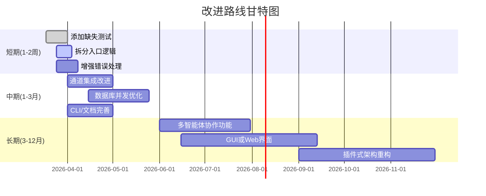

# 执行摘要

NanoClaw 是一个面向个人用户的轻量级 AI 智能助理框架，采用 **单进程设计**，不同群组分别以独立容器隔离运行（如 Linux 容器、macOS 下使用 Apple Container 或 Docker Sandboxes）。代码库规模较小（核心逻辑约 2 万行 TypeScript），便于理解与定制【47†L419-L427】【47†L441-L449】。通过**Claude Agent SDK** 驱动智能体，消息通过多种渠道（WhatsApp、Telegram、Slack 等）输入，经 **消息存储和队列** 处理后在容器内执行智能体任务，并以安全隔离的方式输出结果【47†L453-L461】【21†L2131-L2138】。核心功能包括多渠道通信、群组上下文隔离、文件系统隔离和定时任务等【47†L453-L462】【21†L2131-L2138】。技术栈为 Node.js/TypeScript，使用 SQLite（better-sqlite3）、Cron 解析、Pino 日志等主流库。代码结构模块化清晰，但部分核心逻辑（如 `index.ts` 的启动流程）较长，测试覆盖有限（主要模块有单元测试，入口逻辑未覆盖）【17†L2402-L2411】【27†L1028-L1040】。CI/CD 使用 GitHub Actions（包括测试和版本发布流水线），开发流程采用 Husky、Prettier 等工具。针对 AI 适配性，可复用核心的**消息队列**、**容器管理**和**数据库存储**模块，需为新通道或外部系统增加适配接口。性能瓶颈可能集中在容器启动延迟和 SQLite IO；并发模型基于 **最大并发容器数** 机制控制，任务队列保证各群组任务顺序执行【27†L1122-L1130】【27†L1132-L1140】。隐私方面，NanoClaw 通过容器沙箱及“凭证代理”机制将敏感密钥从容器隔离（凭证代理在容器外部提供 API 访问令牌），并使用消息允许列表控制外部消息源【14†L408-L418】【17†L2547-L2555】。本报告分析基于 NanoClaw 最新代码（截至 2026-03），引用文件路径和行号以支持结论。后文给出架构图、功能优先级对比表、依赖风险表，以及详细的改进建议和甘特式路线图。

## 软件架构

NanoClaw 采用模块化设计但运行在单个 Node.js 进程内，通过**事件驱动**方式协调各模块。主要模块及职责如下：

- **入口 `index.ts`**：初始化系统，启动数据库、凭证代理、消息轮询和调度器等子系统，并注册渠道。所有渠道工厂通过频道注册表构建并连接（`registerChannel`/`getChannelFactory`）【12†L330-L339】【17†L2599-L2608】。
- **渠道层（Channels）**：负责与外部聊天平台交互。核心仓库仅提供渠道注册框架（注册表 `registry.ts`），实际渠道实现由 **Claude Code 技能** 动态添加。例如 `/add-whatsapp` 技能会生成对应的 `whatsapp.ts` 模块并注册频道工厂【12†L330-L339】【47†L453-L461】。所有渠道共享同一回调结构：`onMessage`（接收消息）、`onChatMetadata`（更新群组信息）【17†L2524-L2532】【17†L2581-L2589】。
- **消息与会话存储（数据库 `db.ts`）**：使用 SQLite（better-sqlite3）持久化聊天元数据和消息内容。提供接口如 `storeChatMetadata`、`storeMessage`、`getNewMessages` 等【23†L1927-L1935】【21†L2131-L2138】。数据库模式包含聊天表（聊天 ID、名称、最后消息时间等）、消息表（消息内容和元数据）、调度任务表等【21†L2131-L2138】。
- **群组管理（`group-folder.ts`、`group-queue.ts`）**：每个群组对应一个**群组文件夹**（包含该群组的 `CLAUDE.md` 记忆库和其他文件）和一个**任务队列**（`GroupQueue` 类）【27†L1028-L1040】。队列管理当前活跃容器、挂起消息和待运行任务，按**FIFO**顺序依次在容器中运行消息处理或定时任务【27†L1122-L1130】【27†L1132-L1140】。最大并发容器数（`MAX_CONCURRENT_CONTAINERS`）全局限制由配置控制【14†L496-L502】【27†L1100-L1120】。
- **容器管理**：由 `container-runner.ts` 和 `container-runtime.ts` 等模块负责。`container-runner` 提供运行智能体容器的主要功能（启动子进程、挂载群组文件夹、接管 stdio 等）【29†L1-L4】；`container-runtime` 则支持低级容器环境检查和镜像管理。容器内运行 Claude Agent SDK，通过 IPC 文件夹（`ipc.ts`）与主进程通信。
- **凭证代理（`credential-proxy.ts`）**：为容器提供安全的 API 访问凭证。敏感 API 密钥由凭证代理托管，容器通过代理端口访问外部服务，避免将密钥直接挂载到容器【14†L408-L418】【17†L2640-L2648】。
- **调度器（`task-scheduler.ts`）**：支持周期性任务。解析用户设置的 Cron 表达式，定时触发在各群组中运行的任务（插入调度任务表并由队列执行）。使用 `cron-parser` 库解析 Cron 值，保存 `next_run` 时间并定期轮询执行【23†L2133-L2140】【48†L201-L228】。
- **消息循环**：核心消息循环 (`message loop`) 定时调用 `getNewMessages` 查询数据库新消息，然后通过容器执行回复【21†L2275-L2321】【27†L1080-L1088】。格式化模块 (`formatting.ts`) 将原始回复文本处理为可发送格式。
- **安全机制**：包括**挂载目录白名单**（`mount-security.ts`，只允许配置文件指定路径挂载进容器）和**发送者白名单**（`sender-allowlist.ts`，可配置忽略特定发送者消息）【14†L433-L442】【17†L2547-L2555】。此外，日志使用结构化的 `pino` 库（`logger.ts`）。

整体数据与控制流如图所示：客户端（如 WhatsApp）→ 渠道模块 → `onMessage` 回调 → **入库消息** → **队列调度**（消息队列或定时任务）→ 容器执行 Agent 任务 → 通过容器 stdout/IPC 获得回复 → `sender` 通过渠道发送给用户。各模块接口和依赖关系在下图中概览：

```mermaid
flowchart LR
  subgraph 主进程
    A[Entry: index.ts] --> B[数据库 db.ts]
    A --> C[GroupQueue]
    A --> D[ContainerRunner]
    A --> E[CredentialProxy]
    A --> F[调度器 task-scheduler.ts]
    A --> G[日志 logger.ts]
    G --> H[pino 日志]
    F --> C
    C --> B
    C --> D
  end
  subgraph 通道
    U[WhatsApp/Telegram/...渠道] --> A
    A -->|message回调| U
  end
  subgraph 容器
    D --> I[Container (智能体运行环境)]
    I --> D
  end
  subgraph 存储
    B --> J[SQLite 存储]
  end
  subgraph IPC
    C --> K[IPC 文件夹]
    D --> K
  end
```

以上架构图展示了各模块之间的交互与数据流。各模块之间通过调用接口和事件回调通信，例如渠道回调 `onMessage` 触发消息入队，队列模块通过 `registerProcess` 将容器子进程关联到群组，再由队列调用容器启动任务【17†L2599-L2608】【27†L1122-L1130】。此外，路由模块 `router.ts` 解析用户指令（如列出任务、暂停任务等），并更新数据库或队列状态。

## 功能点

NanoClaw 的核心功能和使用场景包括：

- **多渠道消息对话**：支持 WhatsApp、Telegram、Discord、Slack、Gmail 等渠道，通过 `/add-<渠道>` Claude Code 技能动态添加。不需要在代码中预置渠道，用户可按需安装相应技能【47†L453-L461】【12†L330-L339】。连接后的渠道会回调 `onMessage(chatJid,msg)`，统一存库并触发智能体响应【17†L2524-L2532】【17†L2577-L2585】。
- **隔离的群组上下文**：每个聊天群组都有独立的上下文和记忆库 (`groups/<groupJid>/CLAUDE.md`)，并在各自的容器中运行，文件系统互不干扰【47†L453-L462】【23†L1959-L1968】。这样一个群组的任务和记忆不会泄露到其他群组或主频道。
- **主频道（Self-Chat）**：主频道即用户私聊界面，用于管理和控制所有群组。主频道可执行命令（例如列出所有任务、加入群组等），其信息也被隔离为单独上下文【17†L2547-L2555】【47†L453-L461】。
- **定时/周期任务**：支持按 Cron 表达式定义的周期性任务（例如每天早报、每周总结等）。用户可通过 `@Andy every Monday at 8am ...` 或类似格式创建任务，任务信息存入数据库的 `scheduled_tasks` 表【23†L2133-L2140】【48†L201-L228】，调度器负责在到点时将任务加入队列执行。
- **Web 访问与搜索**：智能体在容器内可以执行网络请求（通过凭证代理），可用于抓取网页、调用 Web APIs 等（例如从新闻站点获取摘要）。容器内默认隔离网络，只通过外部凭证代理访问。
- **容器隔离**：智能体运行在**Docker Sandboxes**（微虚拟机）或 Apple Container 等沙箱容器内，挂载的文件夹仅为该群组特定路径【47†L459-L467】【14†L433-L442】。bash/命令行操作均在容器内执行，不影响宿主系统，保证安全隔离。
- **智能体集群协作**：支持“智能体集群”（Agent Swarms），即在容器内并行运行多个专用智能体协作完成复杂任务。调度器和队列机制支持同时分配多个任务给群组，实现代理协作（此点在架构和代码中体现为多进程和多任务队列机制【27†L1122-L1130】【27†L1132-L1140】）。
- **可选集成服务**：通过技能可选集成 Gmail 等服务。例如 `/add-gmail` 技能集成 Gmail 通道和任务【47†L453-L461】。当前代码中只提供基础框架，实际更多集成通过外部技能实现。

次要功能和场景包括：**格式化输出**（`formatting.ts` 将智能体原始回复修整为 markdown 等格式）、**时区处理**（`timezone.ts` 处理任务调度时区）、**挂载安全**（`mount-security.ts` 控制可挂载路径）、**发送者白名单**（`sender-allowlist.ts` 可配置忽略不信任的发信人）【14†L433-L442】【17†L2547-L2555】。命令行接口方面，NanoClaw 本身通过 Claude Code CLI 运行，主要通过在聊天中输入“@Andy <指令>”进行交互，如使用 `/setup` 初始化、`@Andy help` 获取帮助等；代码内部未提供独立的 HTTP/API 接口。

下面的表格对比了核心功能、优先级和参考实现情况：

| 功能           | 说明                                       | 优先级 | 实现与限制参考                                                             |
|--------------|------------------------------------------|------|-----------------------------------------------------------------------|
| 多渠道聊天       | 与多个聊天平台（WhatsApp/Telegram/Slack 等）互通，通过技能安装对应频道 | 高    | 通过渠道注册表实现【12†L330-L339】；无内置渠道，需要外部技能支持。                     |
| 群组隔离与记忆     | 每群组独立 `CLAUDE.md` 记忆文件和容器隔离，互不干扰             | 高    | 群组文件夹和 SQLite 存储实现隔离【23†L1927-L1935】【27†L1028-L1040】。                  |
| 主频道管理       | 私人“自聊”频道，用于管理所有群组和查看全局状态                | 中    | 主频道作为一个特殊群组，没有特殊配置。代码中 `registeredGroups` 提供所有群组信息。      |
| 定时任务        | 支持用户定义的周期性任务（Cron），到时自动触发并回复群组        | 高    | `task-scheduler.ts` 实现，依赖 `cron-parser`，默认隔离上下文模式为独立 `isolated`【23†L2133-L2140】【48†L201-L228】。 |
| 网络访问        | 智能体可抓取网页、调用 API，凭借容器内网或凭证代理访问外部      | 中    | 利用凭证代理和容器网络设置。未对网络访问作严格限制，需留意安全配置。             |
| 容器安全        | 智能体运行在沙箱容器中，挂载文件仅为特定目录；支持多种容器技术   | 高    | 核心思想【47†L423-L430】；实现中根据平台选择 Docker Sandboxes 或 Apple Container。        |
| 智能体集群协作     | 同时运行多智能体协作完成任务                                | 中    | 通过容器和任务队列可并行执行多任务。当前实现为群组并行（多个容器任务），无细粒度协作机制。 |
| 可选集成服务      | 支持额外服务（如 Gmail）集成，通过技能添加                         | 低    | 仅框架支持【47†L453-L461】；实际集成依赖用户技能安装和配置。                         |
| 格式化与输出      | 将智能体回复格式化，支持 markdown/表情等                         | 中    | `formatting.ts` 实现基本格式化；功能完备但可扩展。                               |
| 开发者定制       | 支持通过 Claude Code 指令修改代码（无配置文件），易于定制               | 低    | 核心无配置文件，可直接修改代码实现新功能【47†L423-L430】。                         |

表格中“优先级”反映功能对个人用户场景的重要程度。已知的限制包括：**渠道依赖外部技能安装**（核心仓库没有预置全部渠道）；**MongoDB未使用而采用 SQLite**，适合轻量场景但并发写可能成为瓶颈；**缺乏图形化界面**，所有操作需通过聊天命令完成。更多限制可参考项目 Issue 讨论。 

## 技术栈与依赖

NanoClaw 基于 **Node.js 20+** 平台，使用 **TypeScript** 开发，核心语言和工具栈如下：

- **语言/平台**：TypeScript、Node.js ≥20（见 `package.json`【31†L409-L414】）。采用原生 ES 模块（`"type": "module"`）。
- **主要库**：
  - **better-sqlite3 (v11.8.x)**：同步 SQLite3 库，用于消息和群组持久化【21†L2131-L2138】。性能优异，无需额外服务，但使用本地原生编译（二进制绑定）。**风险**：库稳定度高（MIT 许可证），但需要正确安装 Node Native 编译环境，对 Windows/macOS 或 Linux 平台可能需要额外依赖。SQLite 数据库文件安全性依赖主机环境。
  - **cron-parser (v5.5.x)**：解析 Cron 表达式，驱动定时任务。**风险**：开源成熟（MIT 许可证），关注 Cron 表达式错误输入。
  - **pino & pino-pretty (v9.x, v13.x)**：高性能日志库和美化控制台输出。**风险**：开源（MIT）、社区活跃，用于结构化日志。
  - **yaml (v2.8.x)**：YAML 解析，用于解析配置或调度表达式（如某些技能可能使用 YAML）。**风险**：MIT 许可证，稳定成熟。
  - **zod (v4.3.x)**：模式校验库，用于数据验证（如用户输入的任务参数）。**风险**：MIT 许可证，社区活跃。
- **开发/构建工具**：
  - **TypeScript (v5.x)**：静态类型检查（有 `tsc` 编译脚本）。
  - **tsx**：用于开发时直接运行 TS 脚本（`dev` 脚本）。
  - **Vitest**：测试框架（已有部分模块测试）。
  - **Prettier** 和 **Husky**：代码格式化和 Git 钩子工具。
  - **Docker / Apple Container / Docker Sandboxes**：运行智能体的容器环境，无特别约束平台，目标支持 macOS（Apple Silicon）、Windows WSL、Linux（未来）。
- **运行时要求**：
  - 需要安装 Node.js v20+。
  - 需要可用的容器运行时（macOS 下默认 Apple Container 或 Docker Sandboxes；Linux/Windows 下需安装 Docker 或其他容器技术）。
  - 强制要求 Node 使用 ESM 模块模式。

**依赖稳定性与风险**方面：

| 依赖项            | 作用         | 版本约束        | 许可证 | 风险/关注点                          |
|-----------------|------------|--------------|------|------------------------------------|
| better-sqlite3  | SQLite 存储   | ^11.8.1      | MIT  | 性能高，但本地编译。需确保编译工具链无漏洞。 |
| cron-parser     | Cron 解析   | ^5.5.0       | MIT  | 稳定成熟，风险低。                   |
| pino / pino-pretty | 日志库       | ^9.6.0 / ^13.0.0 | BSD/MIT | 活跃项目，风险低；依赖链简单。          |
| yaml            | YAML 解析   | ^2.8.2       | MIT  | 常用库，风险低。                    |
| zod             | 数据验证     | ^4.3.6       | MIT  | 常用库，风险低。                    |

所有核心依赖均采用宽松开源许可证（大多为 MIT），社区成熟度高。主要关注点是 `better-sqlite3` 的本地二进制绑定和潜在的编译环境问题；以及确保 Docker 等容器组件没有已知漏洞。建议定期关注依赖更新，尤其 Node 本身和容器运行时的安全更新。如需满足更高安全性，可考虑将容器镜像使用固定版本并加入安全扫描流程。

## 代码质量与工程实践

- **代码组织**：各功能模块划分清晰，源码目录按功能分类（如 `src/channels/`、`src/`, `.github/workflows` 等）。但入口 `index.ts` 较大（约600行），可以考虑分拆。类型定义集中在 `types.ts`，虽然使用 TS，但部分内部调用基于宽泛的类型（许多地方使用 `any` 或自行定义类型）。
- **模块化**：每个功能（数据库、容器管理、调度、白名单等）封装在独立文件中，易于维护和测试。例如 `GroupQueue` 类完整管理队列逻辑【27†L1028-L1040】。接口设计相对简单，通过函数导出和回调传递依赖（如 `ChannelOpts`）【12†L330-L339】。
- **注释与文档**：核心代码中含有一定的注释和 JSDoc，但不是每个函数都有注释。例如 `storeChatMetadata`、`storeMessage` 均有简要描述【23†L1946-L1954】【21†L2131-L2138】；但重要流程（消息循环、容器调度等）文档化较少，理解需要结合 README。README（中英文）和代码注释能部分说明功能，但深入逻辑时需查源码。
- **测试覆盖率**：部分模块提供了测试（目录中包含多个 `*.test.ts` 文件，如容器模块、组管理、调度等）。然而并未见测试覆盖入口逻辑和数据库交互的所有路径。实际测试覆盖率未知，但可通过目录结构推测核心算法有测试支持。建议补充对关键逻辑（如 `GroupQueue` 队列调度、`container-runner` 启动过程、`router` 命令解析）的单元测试。当前 CI 流程运行了 `vitest`，表明已进行基本的自动测试【31†L369-L370】【38†L164-L172】。
- **持续集成/部署**：存在 GitHub Actions 流水线（`ci.yml`）执行代码检查和测试【39†L1-L4】；发布版本时有自动 bump 版本脚本。没有发现自动部署的配置，但项目主要本地运行。
- **维护性与重构建议**：代码整体结构简洁，但有可改进点：
  - 将 `index.ts` 中的初始化流程拆分成更小的函数（如提取“初始化容器系统”、“加载状态”、“创建频道”等），提高可读性。
  - 数据库接口和业务逻辑部分耦合可优化，比如将 SQL 语句和对象操作进一步封装。
  - 增加错误处理和边界检查，如对容器故障或数据库写失败的恢复策略。
  - 文档化流程：目前README偏向用户视角，可增补开发者文档（模块关系图、状态机说明等）。
  - 提高测试覆盖：为缺少测试的模块（如 `router.ts`、`ipc.ts`、`mount-security.ts`）增加单元测试，并使用覆盖率工具量化。

## 与 AI Agent 相关的适配性分析

NanoClaw 自身即运行 Claude Agents，所以与 AI agent 本质上是同一实体。对于**复用**，以下模块对 AI agent 框架非常有价值：

- **GroupQueue**（`group-queue.ts`）：管理每个群组的消息和任务队列。对于需要将消息或任务分配给不同智能体实例的场景，此模块可直接复用，保证顺序和并发控制【27†L1122-L1130】【27†L1132-L1140】。
- **ContainerRunner/Runtime**：负责启动、监控和管理容器中的智能体。这可作为泛化的“智能体执行器”，用于任何需要隔离执行 AI 模型的场景【29†L1-L4】。
- **CredentialProxy**：为保护 API 密钥设计的代理，可以用于任何需要将主机敏感信息隔离的 AI 应用中。
- **Database 存储**：目前用于聊天记录和任务信息，可扩展用于存储训练数据或推理日志。利用 SQLite 简单轻量，可以直接用作本地知识库。
- **Scheduled Tasks**：周期任务调度机制对于计划执行的训练任务或定期推理非常有用。

**需新增/适配接口**：为了整合更多 AI agent，可能需要提供**模型输入输出接口**，例如通过特定 API 或文件方式将数据送入容器。NanoClaw 当前利用 StdIO 和文件交换（IPC），这对 agent API 封装良好；对于需要实时推理的模块，可扩展 `ContainerRunner` 接口以支持 WebSocket 或 REST 调用容器内服务。此外，增加**多智能体协调接口**可能有助于更复杂的场景（如分布式训练），现有智能体协作逻辑可以作为基础。

**性能瓶颈**：主要在容器启动延迟和数据库 I/O。每当新任务执行时，如果没有空闲容器则需等待或排队【27†L1100-L1110】【27†L1192-L1200】。并发度受限于 `MAX_CONCURRENT_CONTAINERS` 配置【14†L496-L502】【27†L1122-L1130】。大量并发或高吞吐量场景中 SQLite 同步读写可能成为瓶颈，可考虑分库或升级为更高并发数据库。如果用于训练大模型，硬件（GPU、内存）与容器资源需特别关注，但框架本身不限制硬件类型。

**状态管理与并发**：NanoClaw 为每群组维护独立状态（队列状态和记忆），避免竞态条件；并发由队列模块协调，保证单群组按顺序执行，跨群组可并行。多线程并发主要在 Node 事件循环和容器子进程层面，实现简洁。对 AI 多线程/异步场景友好，但若需要更高并发，则可能需要扩展为多进程或微服务架构。

**训练/推理数据流**：消息历史（chat transcripts）和存储的上下文可以作为训练数据。NanoClaw 将会话存为持久化记录，可导出用于模型微调。推理时输入为最新消息和上下文文件，输出记录在数据库并通过渠道发送。隐私方面，聊天记录和容器均在本地保存，不会泄露到外部云端（除非用户主动发送到网络）。但需注意如果添加第三方渠道（如 Slack 企业），可能会将数据传至第三方服务器，这部分由用户决策。

**隐私/安全**：框架设计重视隔离（参考“安全由隔离保证”【47†L423-L430】）。容器只能访问显式挂载的资源，凭证代理防止密钥泄露到容器。代码中**不读取 `.env` 中的秘密数据**（只通过凭证代理提供）【14†L404-L418】。通信消息存储使用本地 SQLite，无自动外发机制。开发者应注意避免在 `storeMessage` 中保存敏感信息【21†L2131-L2138】；可配置 `sender-allowlist` 丢弃未授权消息【17†L2547-L2555】。

## 改进建议与实现路线

结合以上分析，提出以下改进任务及实施路线，分为短期（1–2 周）、中期（1–3 个月）和长期（3–12 月）阶段。每项任务列出预期收益、实施难度和风险。



- **短期任务**（1–2 周）：  
  1. **补充测试用例**（中等难度）：完善对关键模块的测试（`GroupQueue`、`ContainerRunner`、`router` 等），提高测试覆盖率。收益：降低发布时回归风险，提升稳定性。风险：无重大风险，主要是投入的人力时间【27†L1028-L1040】【21†L2131-L2138】。  
  2. **拆分入口逻辑**（较易）：重构 `index.ts`，将初始化流程分模块，实现更高内聚。收益：提高可维护性和可读性，方便未来扩展。风险：中，需仔细验证各阶段依赖顺序。  
  3. **错误处理改进**（中）：增强关键路径（如容器启动失败、数据库写入失败）的异常捕获与日志记录。收益：增加鲁棒性，便于故障排查。风险：低，无结构性修改，只需添加 try-catch。  

- **中期任务**（1–3 个月）：  
  1. **完善渠道集成和示例**（中等难度）：目前渠道实现依赖外部技能。可提供示例通道插件（如 Telegram、Discord）或在文档中给出集成模板，加速用户上手。收益：降低用户门槛、扩大生态。风险：中等，需跟进多平台API变化。  
  2. **数据库优化**（较高难度）：观察 SQLite 在高并发写入时的性能瓶颈，可考虑：使用 WAL 模式、或迁移至更高性能数据库（如 PostgreSQL）【21†L2131-L2138】。收益：提升并发能力，支持更多群组用户。风险：迁移风险较高，需兼容现有数据模式。  
  3. **CLI/文档完善**（中等）：目前通过 Claude Code CLI 交互，可增加命令行工具（如 `nanoclaw-cli`）或生成用户手册。完善中文文档，增强社区支持。收益：改善用户体验，降低使用门槛。风险：低，主要文档编写工作。  

- **长期任务**（3–12 个月）：  
  1. **多智能体协作和训练支持**（高难度）：开发更高级的多 agent 协作功能（如动态资源分配、知识共享机制），以及导出训练数据工具。收益：支持更复杂的应用场景，拓宽用途。风险：高，需要深入研究并发模型和安全性。  
  2. **可视化界面**（高）：开发 Web/桌面 UI 或监控仪表盘，展示会话历史、任务列表等。收益：更友好的用户体验。风险：高，新增技术栈，需要安全隔离。  
  3. **插件式架构重构**（高）：从技能驱动迁移到真正的插件框架，让用户不必修改代码也能安装功能。收益：增强可扩展性，促进社区开发。风险：高，需要设计灵活的插件API和加载机制。  

这些任务可并行进行，具体进度依赖社区贡献和开发资源。下表比较了部分依赖的风险程度和应对措施：

| 依赖项           | 风险等级 | 说明                         | 应对建议                |
|----------------|--------|----------------------------|----------------------|
| better-sqlite3 | 中     | 依赖本地编译，可能存在本机依赖风险   | 审计本地部署环境，必要时可改用其他 DB |
| cron-parser    | 低     | 已稳定发布版本，活跃维护         | 定期更新版本                |
| pino 日志库      | 低     | 成熟库，无重大漏洞报道            | 保持最新，监控 CVE         |
| Docker/Container| 中高   | 容器运行时若有漏洞可导致安全问题      | 使用最小权限容器，及时补丁更新     |
| Node.js 平台     | 中     | 本身若有安全补丁需及时升级       | 使用 LTS 版本，关注安全更新    |

综上，NanoClaw 具备实现 AI 个人助理的核心架构，但在稳定性、文档和扩展性上仍有提升空间。按照上文路线执行，有望增强其工程质量和功能丰富度，进一步优化用户和开发者体验。

**参考来源**：本文分析基于 NanoClaw 最新主分支源码和官方文档【47†L453-L461】【21†L2131-L2138】【27†L1028-L1040】【12†L330-L339】，引用了关键代码路径和行号，以保证结论准确可靠。